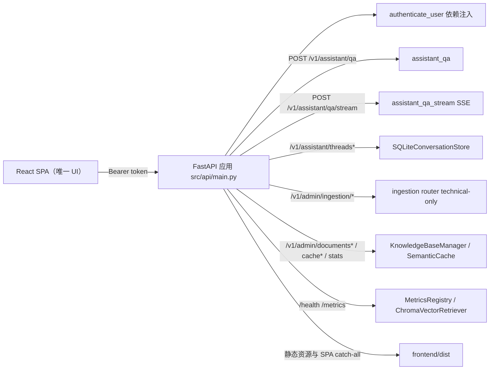
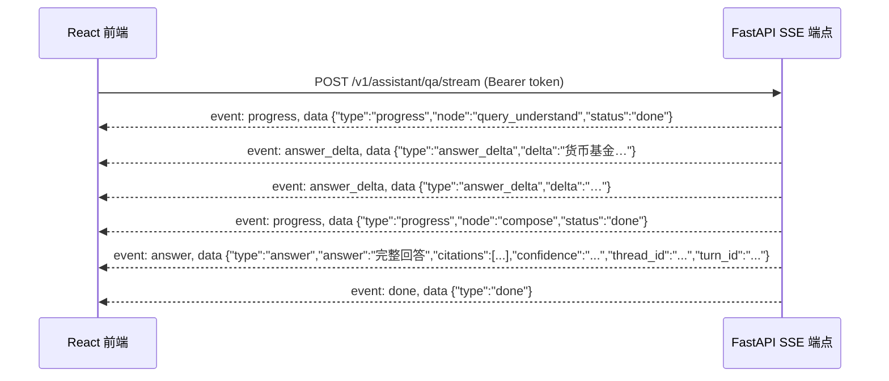

# API 表面与前端契约

本页是 SecRAG 的 HTTP 公共表面清单：每个端点的路径、请求/响应模型、角色要求与错误映射，以及 React 前端（`frontend/src/api.ts`）消费这些接口的方式。问答请求在图内部如何执行、每个节点做什么，请读[问答请求执行链路](../tutorials/request-execution.md)；状态字段与安全边界见[状态、权限与安全边界](state-and-safety.md)。本页只讲“线上长什么样、前端怎么接”。



HTTP 表面总览：所有业务端点（除 `/health`、`/metrics`、静态与 UI 页面）都要求 Bearer token；图内部节点流程不在此页展开。旧版 HTML UI（`src/api/ui.py`/`ui.html`/`admin.html` 与 `/legacy` 路由）已整体删除，React SPA 是唯一 UI，`frontend/dist` 构建产物缺失时服务启动直接失败。

## 1. 认证契约：只相信 Bearer token

`src/api/auth.py` 的 `authenticate_user` 是几乎所有业务端点的 FastAPI 依赖。它只接受 `Authorization: Bearer <token>` 格式，从服务端固定表 `TOKEN_USER_BINDINGS` 查出 `AuthenticatedUser(user_id, role, department)`：

| Token | user_id | 角色 | 部门 | 数据权限 |
| --- | --- | --- | --- | --- |
| `demo-advisor` | `user_advisor` | `advisor` | `wealth` | public + internal |
| `demo-sales` | `user_sales` | `institutional_sales` | `sales` | public + internal |
| `demo-compliance` | `user_compliance` | `compliance` | `control` | public + internal + confidential |
| `demo-ops` | `user_ops` | `operations` | `ops` | public + internal |
| `demo-tech` | `user_tech` | `technical` | `tech` | public + internal + confidential |

认证失败一律 401：缺失 Authorization 头（`missing bearer token`）、非 Bearer scheme 或空 token（`invalid authorization header`）、未绑定 token（`unknown demo token`）。角色与数据权限映射分别来自 `ROLE_ALLOWED_SOURCES`（Planner 过滤检索源）与 `ROLE_DATA_PERMISSIONS`（结果级过滤）。

两个配套约束保证身份不可伪造：

- `AssistantQARequest`（以及 `ConversationThreadCreate`、`IngestionRunCreate`）使用 `extra="forbid"`，请求体里出现 `user_id`、`user_role`、`department` 等身份字段直接 422 校验失败——测试 `test_assistant_request_rejects_removed_identity_fields` 覆盖这一点；
- 认证成功后 `build_assistant_initial_state` 把身份写进 `AssistantState`，图内所有节点只读状态中的身份，不再信任用户输入。

demo token 只适合本地演示，不能替代生产 IdP 与签名 token。

## 2. 端点清单

所有路径常量集中在 `src/schemas/constants.py` 的 `API_ROUTE_*`。角色列标注该端点可访问的最小角色；`admin` 角色是“代码内硬编码检查”的伪角色（`user.role != "admin"` 时 403），demo token 绑定表中没有 admin token——`demo-tech` 可访问绝大多数管理端点，但 `DELETE /v1/admin/documents` 与 `GET /v1/admin/stats/queries` 只能由 `admin` 访问。

### 2.1 问答与会话

| 方法与路径 | 角色 | 说明 |
| --- | --- | --- |
| `POST /v1/assistant/qa` | 任意已认证 | 普通 JSON 问答，返回 `AssistantQAResponse` |
| `POST /v1/assistant/qa/stream` | 任意已认证 | SSE 流式问答，事件协议见第 4 节 |
| `GET /v1/assistant/threads?limit=50` | 任意已认证 | 列出当前用户的活跃会话，按 `updated_at` 倒序 |
| `POST /v1/assistant/threads` | 任意已认证 | 创建会话，请求体 `{client_id?, title}`，返回 `ConversationThreadResponse` |
| `GET /v1/assistant/threads/{thread_id}/messages` | 任意已认证 | 会话消息，返回 `{thread_id, messages: [...]}` |
| `DELETE /v1/assistant/threads/{thread_id}` | 任意已认证 | 软删除会话与消息，成功返回 204 无响应体 |

### 2.2 入库管理（仅 technical）

由 `src/api/ingestion.py` 的 router 挂载，`require_technical_user` 依赖强制 `user.role == "technical"`，否则 403 `technical role required`。创建入库任务后由 FastAPI `BackgroundTasks` 在进程内异步执行。

| 方法与路径 | 说明 |
| --- | --- |
| `GET /v1/admin/ingestion/categories` | 分类列表 + 当前活跃 run_id，含预检就绪状态 |
| `GET /v1/admin/ingestion/categories/{category_id}/files` | 某分类下的文件清单与 manifest 状态 |
| `GET /v1/admin/ingestion/chunks?doc_id=&offset=&limit=` | 按 doc_id 查看 chunk 内容与元数据（`limit` 1–100） |
| `POST /v1/admin/ingestion/runs` | 创建入库任务，请求体 `{category_id}`，返回 202 + `IngestionRunCreateResponse` |
| `GET /v1/admin/ingestion/runs?limit=` | 最近任务列表（`limit` 1–50） |
| `GET /v1/admin/ingestion/runs/{run_id}` | 单任务状态与统计（created/replaced/skipped/archived/failed） |
| `GET /v1/admin/ingestion/runs/{run_id}/items` | 任务逐文件处理结果 |

### 2.3 知识库管理（admin / technical）

| 方法与路径 | 角色 | 说明 |
| --- | --- | --- |
| `GET /v1/admin/documents?doc_type=&limit=&offset=` | admin/technical | 按 source 分组的文档列表 `{total, documents}` |
| `GET /v1/admin/documents/stats` | admin/technical | `{total_chunks, total_documents, by_doc_type, by_doc_type_chunks}` |
| `GET /v1/admin/documents/chunks?source=&limit=&offset=` | admin/technical | 某文档的 chunk 详情（排查检索质量用） |
| `GET /v1/admin/documents/search?query=&top_k=` | admin/technical | 直接向量检索预览，不经过 Agent |
| `DELETE /v1/admin/documents?source=` | 仅 admin | 按 source 删除文档全部 chunk，返回 `{source, deleted_chunks}` |
| `GET /v1/admin/stats/queries?days=7` | 仅 admin | 查询统计：总量、无引用查询、命中率、日均、最近无引用示例 |

### 2.4 语义缓存（admin / technical）

缓存自 ISSUE-26 起默认启用（`config.semantic_cache_enabled` 默认 `True`），绑定身份、授权范围、客户上下文、规范化问题、上下文摘要与知识库版本六维后才能命中；运维语义详见[观测与运维](../operations/observability.md)。

| 方法与路径 | 角色 | 说明 |
| --- | --- | --- |
| `GET /v1/admin/cache/stats` | admin/technical | 缓存条目数、命中率（真实 lookup 口径）、阈值、TTL、enabled |
| `POST /v1/admin/cache/clear?clear_expired_only=` | admin/technical | `false`（默认）全清；`true` 只清过期条目，返回 `{cleared, mode}` |

### 2.5 健康检查、指标与静态页面

| 方法与路径 | 说明 |
| --- | --- |
| `GET /health` | 存活检查：`{status: "ok", timestamp, chroma: {status, doc_count}, metrics: {...}}`。ChromaDB 异常只把 `chroma.status` 置为 `"error"`，整体仍返回 200，避免负载均衡器摘除节点；`metrics` 是 `MetricsRegistry.get_summary()` 摘要（uptime、查询数、成功率和延迟百分位等） |
| `GET /metrics` | Prometheus 文本格式导出（`text/plain; version=0.0.4`），指标清单见[观测与运维](../operations/observability.md) |
| `GET /` | 返回 React SPA `frontend/dist/index.html`（旧版 HTML UI 已删除） |
| `GET /admin` | 返回 React `index.html`，由前端 `AdminPage` 路由接管 |
| `GET /assets/*` | `StaticFiles` 挂载的 `frontend/dist/assets` 静态资源 |
| `GET /{full_path:path}` | SPA catch-all：非 `v1/`、`health`、`metrics`、`docs`、`openapi.json` 前缀时返回 `index.html`，否则 404 |

React 构建产物是硬前置：模块导入时 `_ensure_frontend_dist()` 检查 `frontend/dist` 是否存在，缺失直接 `RuntimeError`（提示 `cd frontend && npm run build`）终止启动，不再有任何 HTML 兜底。SPA 通配路由必须注册在所有业务路由之后（`src/api/main.py` 注释明确要求）：Starlette 按注册顺序匹配路径，若通配 GET 先注册会截走 `/health`、`/metrics` 等接口。`tests/test_api_routes.py::test_unknown_api_path_returns_404_not_index_html` 通过真实 ASGI 栈验证未知 API 路径返回 404 而不是 index.html。

## 3. 问答端点：POST /v1/assistant/qa

请求体 `AssistantQARequest`（`extra="forbid"`）：

```json
{
  "query": "货币基金风险等级怎么查？",
  "client_id": "client-001",
  "thread_id": "可选，缺省自动新建会话"
}
```

- `query`：必填，1–500 字符（超过 500 由 `query_understand` 截断，`MAX_QUERY_LENGTH`）；
- `thread_id`：缺省时 `ensure_thread_for_qa` 自动创建会话（标题取 `query[:100]`）；提供时校验归属当前用户且 active，角色或 `client_id` 与线程记录不一致抛 409，缺失/已删除/跨用户抛 404；
- 身份字段一律拒绝（见第 1 节）。

响应 `AssistantQAResponse`：

```json
{
  "thread_id": "uuid",
  "turn_id": "uuid",
  "answer": "最终回答文本",
  "citations": [{"source": "..."}],
  "confidence": "high | medium | low",
  "compliance": {"passed": true, "flags": [], "risk_disclosure": "..."}
}
```

关键契约：

- **内部 `audit_trail` 不暴露**：`AssistantQAResponse` 不声明该字段，OpenAPI schema 与响应体都没有；测试断言 `audit_trail` 不在 `app.openapi()` 的 schema properties 中；
- **语义缓存内部字段不进响应体**：缓存命中与普通执行统一经 `_qa_response_from_outcome` 出口返回同一个结构，`cached`/`cache_similarity` 只进指标与审计（`tests/test_api_routes.py::test_qa_endpoint_cache_hit_returns_stored_compliance` 断言这两个键不在响应中）；命中响应的 `compliance`/验证终态来自缓存条目存储时的快照；
- 响应模型不含 `verification`，只有 `compliance`；
- 图执行整体受 `asyncio.wait_for(agent.invoke, api_request_timeout_seconds)` 总超时约束（默认 60 秒，`config.api_request_timeout_seconds`）。

执行细节（限流、会话、缓存命中路径、错误映射）见[问答请求执行链路](../tutorials/request-execution.md)。

## 4. 流式端点：POST /v1/assistant/qa/stream（SSE 事件协议）

响应头固定带 `Cache-Control: no-cache`、`Connection: keep-alive`、`X-Accel-Buffering: no`，媒体类型 `text/event-stream`。事件协议（`src/api/main.py` docstring 与 `frontend/src/types.ts` 注释一致）：

| 事件名 | data 载荷 | 语义 |
| --- | --- | --- |
| `progress` | `{"type": "progress", "node": "...", "status": "done"}` | 节点完成进度，只转发 `CLIENT_PROGRESS_NODES` 白名单 |
| `answer_delta` | `{"type": "answer_delta", "delta": "..."}` | reason 节点 LLM 的 token 级增量（ISSUE-9），先于 answer 流出 |
| `answer` | `{"type": "answer", "answer", "citations", "confidence", "thread_id", "turn_id"}` | 终态回答（唯一一次完整载荷，前端以其为准覆盖增量） |
| `error` | `{"type": "error", "detail"}` | 处理异常或限流 |
| `done` | `{"type": "done"}` | 流正常结束，总是最后发出 |



`answer_delta` 的产生方式：`agent.astream` 以 `stream_mode=["updates", "messages"]` 且 `subgraphs=True` 运行，产出 `(namespace, mode, data)` 三元组；只有 `chunk_metadata["langgraph_node"] == "call_reason_model"` 的字符串 token 才转成 `answer_delta` 下发——`query_understand`/`planner` 的 JSON 输出与工具调用轮次的中间文本不得进入回答流。首个 `answer_delta` 到达时记录一次 TTFT 指标（`record_ttft`，ISSUE-23）。

SSE 契约约束：

- **`data.type` 必须与 event 名一致**——后端每个事件都带与 event 名相同的 `type` 字段，前端按同一契约解析（issues.md 一.3）；
- **`progress` 只转发图模块声明的 `CLIENT_PROGRESS_NODES`**：`query_understand`、`planner`、`retrieve`、`grade_and_filter`、`reason`、`verify`、`compose`（`src/agents/graph.py` 的 frozenset）。传输层不解释节点语义、不推断终态；子图内部节点（namespace 非空）不外发进度；
- **`answer` 事件以节点输出同时含 `STATE_TERMINAL` 且带 `final_answer` 为准**，不按节点名推断：`compose`（正常回答/验证失败/合规拦截）、`clarify`（澄清）、`permission_denied_response`（权限拒绝）按此契约声明终态；ReAct 尝试的中间 `final_answer` 不带 terminal 标记，不会误发 answer；
- 整条流受 `asyncio.timeout(config.api_request_timeout_seconds)` 总超时约束；超时或异常先发 `error` 事件，正常路径最后必发 `done`；同步 SQLite 会话调用经 `asyncio.to_thread` 移出事件循环（ISSUE-18）；
- **限流以 `status_code=429` 的 SSE error 事件返回**，而不是普通 HTTP 错误体；错误事件也保证 `data.type == "error"`；
- 客户端断连（`GeneratorExit`/`CancelledError`）不发 done，但 `finally` 中必须收尾 Langfuse trace（标记 `client_disconnected`/`cancelled`）；
- 图执行前的准备阶段异常（如 `ensure_thread_for_qa` 抛错）以 `event: error` + `{"detail": str(exc)}` 发出后 return，不发 done。

`tests/test_api_routes.py::test_qa_stream_emits_terminal_event_protocol` 通过真实流式请求断言：answer 存在、最后事件是 done、progress 节点集合包含白名单节点、每个 `data.type` 与 event 名相等。

## 5. 会话线程接口

`SQLiteConversationStore` 负责持久化（`data/conversations.db`），API 只按当前 `user_id` 读写，线程隔离是硬约束：

- `GET /v1/assistant/threads`：`list_threads` 只返回 `status='active'` 且属于当前用户的线程，`response_model` 为 `{"threads": [ConversationThreadResponse]}`，按 `updated_at` 倒序；
- `POST /v1/assistant/threads`：`create_thread` 写入 `user_id`/`user_role`/`client_id`/`title`，返回 `thread_id`/`title`/`created_at`（`response_model=ConversationThreadResponse`）；
- `GET /v1/assistant/threads/{thread_id}/messages`：`list_messages` 先经 `get_thread_for_user` 校验线程归属当前用户，再返回消息列表；消息字段含 `message_id`/`thread_id`/`turn_id`/`role`/`content`/`sequence`/`created_at`/`request_id`；
- `DELETE /v1/assistant/threads/{thread_id}`：`soft_delete_thread` 把线程与消息 `status` 置为 `deleted`，返回 204 无响应体（前端 `request` 对 204 特殊处理，不走 `res.json()`）。

线程接口错误映射统一走 `_conversation_http_error`：

| 状态码 | 场景 |
| --- | --- |
| 404 | 线程不存在、已删除或属于其他用户（`ConversationNotFoundError`） |
| 409 | 线程的角色或 `client_id` 与当前请求上下文不一致（`ConversationContextMismatchError`） |
| 401 | 无有效 Bearer token |

问答也会通过 `ensure_thread_for_qa` 复用这套校验：`thread_id` 为空时自动建会话，否则按当前用户校验归属与上下文一致性。

## 6. 入库管理接口（technical）

`src/api/ingestion.py` 的 router 挂载在 `src/api/main.py`（`app.include_router(ingestion_router)`），全部端点要求 `Authorization: Bearer` 且 `user.role == "technical"`（`require_technical_user`），否则 403。

`_translate_error` 把入库服务异常映射为 HTTP 错误：

| 状态码 | 场景 |
| --- | --- |
| 404 | 分类不存在（`UnknownIngestionCategoryError`）、任务不存在（`IngestRunNotFoundError`）、文档无可用 chunk（`IngestDocumentNotFoundError`） |
| 409 | 已有入库任务在运行（`ActiveIngestRunError`），detail 带 `active_run_id` |
| 422 | 分类预检失败（`CategoryPreflightError`）、不安全路径（`UnsafeIngestionPathError`）、文件缺失 |

`POST /v1/admin/ingestion/runs` 是唯一的写操作：预检分类 → 创建 queued 任务 → 把 `service.execute_run` 挂到 FastAPI `BackgroundTasks`，进程内异步执行并返回 202。任务状态枚举：`queued` / `running` / `success` / `failed`。

## 7. 错误映射汇总

普通（非 SSE）端点的统一错误语义：

| 状态码 | 场景 |
| --- | --- |
| 401 | 缺失/非法/未知 Bearer token（`authenticate_user`） |
| 403 | 角色越权：非 technical 访问入库接口、非 admin/technical 访问知识库与缓存接口、非 admin 访问 `DELETE /v1/admin/documents` 或 `GET /v1/admin/stats/queries` |
| 404 | 会话/线程、分类、任务、文档不存在或不可访问 |
| 409 | 会话角色/客户上下文不匹配；已有入库任务运行 |
| 422 | 请求体身份字段（`extra="forbid"`）或参数校验失败；入库预检/路径不安全 |
| 429 | 限流：同一 `user_id` 每分钟超过 30 次，带 `Retry-After: 60` |
| 500 | 图执行内部错误（未分类异常） |
| 503 | LLM provider 不可用（httpx/OpenAI 连接、超时、429、401/403/408/409 或 ≥500），附排查指引 |
| 504 | 请求处理超时（`api_request_timeout_seconds`，默认 60 秒） |

限流（`src/utils/rate_limit.py`）是进程内滑动窗口（`check_rate_limit`，key 优先 `user_id`），生产应替换为 Redis。流式端点的 429/超时/异常都以 SSE `error` 事件承载，错误码体现在 SSE 响应的 HTTP 状态上（429 时 `status_code=429`）。

## 8. React 前端消费契约

前端是 Vite + React 18 + react-router-dom 6 的 SPA（`frontend/package.json`），源码在 `frontend/src`，是 SecRAG 唯一的用户界面。开发时 `vite.config.ts` 把 `/v1`、`/health`、`/metrics` 代理到 `127.0.0.1:8000`；生产时由 FastAPI 直接挂载 `frontend/dist`（缺失即启动失败，见 2.5 节）。

### 8.1 token 存储

`frontend/src/api.ts` 的 `getToken()` 读 `localStorage.getItem('secrag_token')`，缺省回退到 `demo-advisor`；`authHeaders()` 把 token 放入 `Authorization: Bearer <token>`。角色切换时（`ChatPage.tsx` 的 `handleTokenChange`）写回 `localStorage.setItem('secrag_token', newToken)`。

### 8.2 API 客户端函数

| 函数 | 请求 | 用途 |
| --- | --- | --- |
| `askQuestion(query, threadId?)` | `POST /v1/assistant/qa` | 同步问答，返回 `AssistantQAResponse` |
| `streamQuestion(query, threadId, onEvent)` | `POST /v1/assistant/qa/stream` | SSE 流式，逐事件回调 `onEvent` |
| `createThread(title)` | `POST /v1/assistant/threads` | 新建会话 |
| `listThreads()` | `GET /v1/assistant/threads` | 会话列表 `{threads}` |
| `getThreadMessages(threadId)` | `GET /v1/assistant/threads/{id}/messages` | 会话消息 |
| `deleteThread(threadId)` | `DELETE /v1/assistant/threads/{id}` | 删除会话（204 处理） |
| `listDocuments(docType?)` / `getDocumentStats()` / `getDocumentChunks(source)` / `deleteDocument(source)` / `searchKnowledgeBase(query, topK)` | 知识库管理各端点 | 管理后台使用 |
| `getCacheStats()` / `clearCache(expiredOnly)` | 缓存统计与清理 | 管理后台使用 |
| `getHealth()` | `GET /health` | 健康检查 |

`request<T>` 统一处理：非 2xx 抛 `HTTP <status>: <body>`，204 返回 `undefined` 而不是解析 JSON。

### 8.3 SSE 解析器与事件消费

`streamQuestion` 用手写解析器而不是 `EventSource`（后者只支持 GET）：

1. `fetch` POST 拿到 `ReadableStream`，`TextDecoder` 边读边按 `\n` 切行；
2. 遇 `event:` 行记录事件名，遇 `data:` 行 `JSON.parse` 载荷；
3. **把 event 名与 payload 合并**：`onEvent({ ...payload, type: payload.type ?? eventName })`——`type` 优先取 JSON 内字段（与后端“data.type 必须与 event 名一致”的契约互备）；
4. 忽略 `[DONE]` 与解析失败的行。

`ChatPage.tsx` 的事件消费：

- `progress`：`setCurrentNode(event.node)`，驱动 `StreamingProgress` 组件按 `STREAM_NODES`（`types.ts` 里 7 个带中文 label 的节点）显示“AI 思考中”进度条；
- `answer_delta`：把 `event.delta` 追加到当前助手消息内容（真流式渲染，无假打字机；`tests/test_stream_progress_contract.py` 明确禁止 `setInterval` 式假流）；
- `answer`：以终态载荷覆盖助手消息的 `content`/`citations`/`confidence`，并把 `thread_id` 回写 `currentThreadId` 以便后续问题沿用同一会话；
- `error`：把消息内容替换为 `错误: <detail>`；
- `done`：清空当前节点、标记流结束。

同步路径（`streamEnabled` 关闭时）用 `askQuestion` 的结果回写 `thread_id` 与完整响应字段。

### 8.4 回答按 markdown 渲染

`frontend/src/utils/markdown.ts` 的 `formatAnswerHTML` 是助手回答的渲染入口（`ChatMessage.tsx` 经 `dangerouslySetInnerHTML` 注入）：先整体 HTML 转义，再执行 markdown 变换（`##` 标题、`**` 加粗、行内代码、管道表格、有序/无序列表、段落与换行），因此输出中唯一可能出现的 HTML 都是该函数自己生成的，不存在用户内容注入路径。该能力自旧版 `ui.html` 的 `formatAnswerHTML` 移植而来。

### 8.5 角色选择必须与后端一致

`ChatPage.tsx` 顶部注释明确：**`ROLES` 的角色取值必须与后端 `TOKEN_USER_BINDINGS` 一致**。前端五个选项 `demo-advisor` / `demo-sales` / `demo-compliance` / `demo-ops` / `demo-tech` 与第 1 节的绑定表一一对应。

### 8.6 前后端进度节点契约

`types.ts` 的 `STREAM_NODES`（key + 中文 label）的 key 必须与后端 `src/agents/graph.py` 的 `CLIENT_PROGRESS_NODES` 完全一致：SSE `progress` 事件携带的就是这些图节点注册名，前端靠 `findIndex` 匹配显示进度步骤，两侧漂移时所有步骤永久灰置（ISSUE-5 的真实故障形态）。`tests/test_stream_progress_contract.py` 从两侧源码解析并断言集合相等、key 唯一，同时守护 `answer_delta` 的事件类型声明与 ChatPage 的真流式消费。

### 8.7 React 路由

`App.tsx` 定义两条路由：

| 路径 | 组件 |
| --- | --- |
| `/` | `ChatPage`（问答） |
| `/admin` | `AdminPage`（知识库管理后台） |
| `*` | 重定向到 `/` |

后端 `GET /`、`GET /admin` 都返回 React `index.html`，由前端路由接管；SPA catch-all 保证 `/admin` 等前端路径刷新不 404（前提是路径不以 `v1/`、`health`、`metrics`、`docs`、`openapi.json` 开头）。

`AdminPage` 聚合 `listDocuments`/`getDocumentStats`/`getCacheStats`（并行加载），提供文档列表、chunk 详情弹窗、按 source 删除、语义搜索预览。

## 9. 相关页面

- [问答请求执行链路](../tutorials/request-execution.md)：图内节点流程、缓存命中路径与错误映射的完整执行细节；
- [状态、权限与安全边界](state-and-safety.md)：`AssistantState` 字段与认证、检索权限、工具授权、验证、合规、审计分层；
- [共享模式：字段常量与 AssistantState](../concepts/schemas-and-state.md)：`STATE_*`/`API_ROUTE_*` 等常量的唯一权威来源；
- [快速开始](../quickstart.md)：启动服务与第一条 curl 问答；
- [知识入库链路](../tutorials/knowledge-ingestion.md)：入库管理与后台执行的完整流程；
- [观测与运维](../operations/observability.md)：语义缓存运维语义、指标清单与追踪接线。
