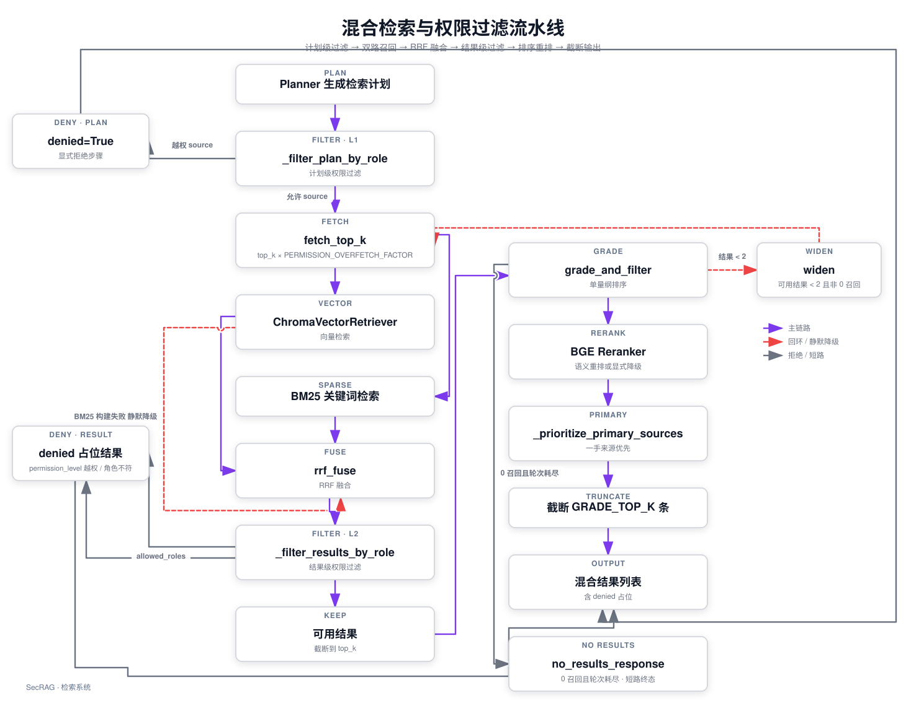

# 检索系统：混合检索与权限过滤

SecRAG 的检索不是一个“只查向量库”的步骤，而是一条有明确阶段的流水线：**Planner 生成计划 → 计划级权限过滤 → 向量 + BM25 双路取回 → RRF 融合 → 结果级权限过滤 → grade_and_filter 排序/去重/语义重排 → 截断**。这条链路的入口是 `src/retrieval/hybrid_retriever.py` 的 `HybridRetriever`，它被 `retrieve` 节点（`src/agents/nodes.py`）和 ReAct 检索工具（`src/agents/tools.py`）共用；检索结果随后进入 `grade_and_filter` 节点做统一整理，最终交给 ReAct 推理作为证据。

一次问答中，检索子系统在全图中的位置是 `planner → retrieve → grade_and_filter`（条件路由可回到 `retrieve` 放宽重跑或回到 planner 重新规划）。外层图的边界与完整分支见 [问答请求执行链路](../tutorials/request-execution.md) 和 [状态、权限与安全边界](state-and-safety.md)。

## 1. 检索控制流



图：检索控制流——计划级与结果级两道权限过滤、向量 + BM25 双路与 RRF 融合、超量取回先于截断、grade_and_filter 排序/重排/主来源优先/截断，以及 widen 放宽轮与零召回短路。

`HybridRetriever` 本身不生成计划、不循环调用 Planner：多跳由 Agent Graph 的条件路由 `should_retry_retrieval`（`src/agents/graph.py`，上限 `DEFAULT_MAX_HOPS`，计数器由 `retrieve` 节点维护）控制，一次 `retrieve` 调用只执行一轮给定计划。每个步骤按 `source` 映射到工厂类（`_SOURCE_RETRIEVER_FACTORIES`：product / regulation / report / faq），由 `_get_retriever` 实例化并缓存。

**多跳路由有五种出口**（`RETRIEVAL_RETRY_ROUTES`）：全部结果被拒走 `denied`；已有 `RETRIEVAL_SUFFICIENT_RESULTS`（2）条可用结果即 `continue` 进入推理（ISSUE-12，不再为置信度评级硬凑证据数）；**非 0 的低召回走 `widen`**——只把 top_k 翻倍重跑检索（ISSUE-24）；0 召回才回 `query_understand` 重新规划；重试耗尽仍 0 召回走 `no_results` 短路（ISSUE-3），不再让模型无证据作答。

**低召回放宽轮**（ISSUE-24）：`retrieve` 节点读 `STATE_RETRIEVAL_WIDENING`，大于 0 时把计划里每步 `top_k` 经 `_widen_top_k` 放大（`WIDEN_TOP_K_FACTOR = 2`，上限 `MAX_WIDEN_TOP_K = 20`）后重跑。放宽是廉价动作（只重跑检索）；`_plan_signature` 以 source/query/filters 计算计划实质指纹，与上一轮相同的计划再跑不会带来新证据，因此重规划只留给 0 召回。

## 2. 双层权限过滤

权限检查贯穿执行层，即使 LLM 误生成了越权计划，执行层仍会拦截。

**计划级**（`_filter_plan_by_role`）：把每个 step 的 `source` 与 `ROLE_ALLOWED_SOURCES[user_role]` 比对。越权的 source **不会静默跳过**，而是被改写成 `denied=True` 的显式步骤（带 `reason="角色 X 无权限访问 Y"`），`retrieve` 循环把它转换成 `_denied_result`（空 content、`permission_denied=True`、score 0）。这样上层能明确提示“部分结果无权查看”。未映射角色（`ROLE_ALLOWED_SOURCES` 无此键）得到空允许集，任何已知 source 都转为拒绝（fail-closed）。未知 source 不在工厂映射中，会被原样放行，最终因 `_get_retriever` 返回 None 而生成“未知检索源”错误结果。

**结果级**（`_filter_results_by_role`）：对每个检索结果先看 metadata 的 `permission_level`——字段缺失或为空时按 `PERMISSION_PUBLIC`（public）处理（安全默认）；不在用户 `data_permissions` 集合内则转为 denied。再看 `allowed_roles`：

- 有 `allowed_roles`（字符串按逗号拆分，或列表）：角色在其中则放行，否则拒绝；
- 没有 `allowed_roles`：公开数据放行；**非公开数据默认拒绝**（安全优先）。

所有拒绝结果都是安全的占位符（空 content），原始文本不会进入后续推理上下文。

## 3. 超量取回先于截断

结果级权限过滤发生在检索端，而不是截断后。每个步骤先按 `PERMISSION_OVERFETCH_FACTOR = 3` 超量取回候选（`fetch_top_k = requested_top_k * 3`），完成权限过滤后再截断到请求的 `top_k`，并把 denied 占位符追加在可用结果之后。这样当高分候选全部越权时，低位可访问文档不会被提前截掉，避免把“部分越权”误判成“全部越权”（issues.md 二.4）。`tests/test_hybrid_retriever.py::test_role_filter_happens_before_truncation` 专门覆盖这一行为。

## 4. 向量检索：共享引擎与 embedding 校验

`ChromaVectorRetriever` 是唯一的向量检索实现（`src/retrieval/vector_retriever.py`）。构造时用 `config.chroma.persist_directory` 打开 `chromadb.PersistentClient`，按 `CHROMA_COLLECTION_NAME = "securities_docs"` 取 collection。`retrieve` 把查询经 `_embed` 转成向量，调用 `collection.query(..., where=filters)`，再在 `_format` 中把 ChromaDB 的 cosine distance 转成统一相似度 **`score = 1 - distance`**。

**领域检索器**（`ProductRetriever` / `RegulationRetriever` / `ReportRetriever` / `FAQRetriever`）只是对共享向量引擎的薄封装：构造时接收一个 `engine`，`retrieve` 时用 `build_retrieval_source_where` 强制附加 `retrieval_source`（逻辑源名，如 `report_search`）的 where 条件，并与其他 filters 用 `$and` 组合。`HybridRetriever._get_vector_engine` 懒加载并缓存**同一个** `ChromaVectorRetriever` 单例传给所有领域检索器——一次检索会话内只建一次 Chroma 连接、只加载一次 embedding 模型。

**Embedding 模型一致性校验**（`_verify_embedding_model`）：检索器初始化时读取 collection metadata 记录的 `embedding_model`，与 `config.embedding.model` 比对：

- 未记录（legacy 数据，值非字符串）：补写当前模型名并 `warnings.warn` 告警，不阻断；
- 记录与当前配置不一致：抛 `RuntimeError` 阻止使用——入库与检索必须使用同一模型，否则向量空间不匹配、检索完全失效。切换 embedding 模型必须全量重新入库。

## 5. BM25 关键词检索与 RRF 融合

`BM25Retriever` 与向量检索互补：向量擅长语义相似，BM25 擅长精确术语（法规条款号、股票代码、产品名）。它在 `_get_index` 中从 ChromaDB collection 全量加载文档（分批 5000）用 jieba 精确模式分词，构建 `BM25Okapi` 索引；索引带**模块级缓存**，key 是 `persist_directory`（稳定的索引身份，不是 engine 实例的 id）。jieba 全量分词耗时 10–30s，`warmup()`（ISSUE-16）让 API 启动时在后台显式触发一次全量索引构建，避免把这笔开销压到重启后的首个请求上。

**构建失败静默降级**：`HybridRetriever._get_bm25_retriever` 懒加载 BM25；构造或索引构建抛异常（如 ChromaDB 为空、依赖缺失）时把 `_bm25_retriever` 置 None 并返回，`retrieve` 里对 BM25 的整个调用块也包在 try/except 中——任何失败都静默回退为**纯向量检索**，不阻断请求。

**来源过滤前置**：BM25 的 filters 用 `retrieval_source`（逻辑源名）**精确匹配**，而不是 metadata 的 `source`（文件路径/URL）；且该过滤在 BM25 内部截断 top_k 之前生效（issues.md 一.4）。这样 metadata.source 是 `data/raw/reports/example.pdf` 这类路径的合法命中不会被误杀。

**RRF 融合**（`rrf_fuse`，`RRF_K = 60`）：对向量与 BM25 两路结果各自按排名计 `1/(k+rank+1)` 累加，以 `chunk_id`（缺省回退 `source:content前50字符`）去重，按融合分降序取前 `top_k`。融合时把原始量纲分别写入 metadata：

- `metadata.vector_score` ← 结果原本的 `score`（向量相似度）；
- `metadata.bm25_score` ← BM25 原始分；
- `metadata.rrf_score` ← 舍入到 6 位的融合分。

返回顺序即融合排序；下游不得再用原始 `score` 重排或阈值过滤融合结果（见第 7 节分数语义）。

## 6. grade_and_filter：单量纲排序、阈值、去重、BGE 语义重排、主来源优先

`grade_and_filter`（`src/agents/nodes.py`）对本轮 `retrieval_results` 做统一整理，产出交给 ReAct 的证据。它先把 denied 结果摘出（保留到末尾供上层提示“部分结果无权查看”），再对可用结果依次：

1. **单量纲排序**：整个候选池只用一种量纲排序（issues.md 一.5），由 `_comparable_retrieval_scores` 统一计算——带 `rrf_score` 的融合结果直接用该分；未融合的纯向量结果按 cosine 排名折算成 RRF 等值分 **`1/(RRF_K + rank + 1)`**（与 `rrf_fuse` 共用 `RRF_K=60`，两处分数可比）。这样混合池（部分来源有 BM25 命中、部分没有）里的融合结果不会被高 cosine 的未融合结果系统性压底。
2. **阈值过滤**：`RETRIEVAL_MIN_SCORE = 0.6` 只适用于**未融合结果的原始 score**；RRF 分数量纲不同（最大约 `2/(k+1)`），带 `rrf_score` 的结果不过滤。
3. **去重**：以 `source + chunk_id（缺省 content）` 为键去重，避免同一证据反复占据上下文；候选池先限制在 `GRADE_TOP_K * 2` 条以内以控制 rerank 开销。
4. **BGE 语义重排**：`_try_rerank_candidates` 调用 `src/tools/rerank.py` 的 `RerankService`（单例、懒加载；模型名取自 `config.rerank_model`，缺省 `BAAI/bge-reranker-v2-m3`）。**当前部署 FlagEmbedding 已安装且权重已本地化，重排真实生效**；仍保留显式降级语义——`FlagEmbedding` 不可导入或模型权重无法获取（`OSError`）都归一为 `RerankerNotConfigured`，映射 `reranker_status="unavailable"` 并保留原始排序，绝不用 cosine 分冒充语义重排；运行期 `RuntimeError`（如分数数量不一致）记为 `error:<msg>`。`reranker_status` 写入 state，`compose` 据此计算置信度（只有 `applied` 才算高置信的必要条件之一），`_node_execution_succeeded` 把 `error:` 状态视为显式执行失败而 `unavailable` 不算。
5. **主来源优先**（ISSUE-22）：重排后、截断前执行 `_prioritize_primary_sources`——公告/财报（一手来源）提到研报/纪要（转述）之前，两组各自保持相关度顺序，防止同一数字的口径被转述带偏。
6. **截断**：保留前 `GRADE_TOP_K`（10）条，denied 占位符追加在结果末尾。

重排成功时 `RR_SCORE`（顶层 score）被 `RerankService` 覆写为 BGE rerank 分数——这是 `score` 键语义的最后一次变化。

## 7. 分数语义：vector_score / bm25_score / rrf_score / RR_SCORE

`RetrievalResult.score`（常量 `RR_SCORE`）和 metadata 中的三个分数键在不同阶段含义不同，阶段内只用一种量纲：

| 阶段 | 顶层 `score`（RR_SCORE） | metadata 分数 | 用途 |
| --- | --- | --- | --- |
| 向量检索 | `1 - cosine distance`（ChromaDB 返回） | — | 向量相似度，越接近 1 越相关 |
| BM25 检索 | BM25 Okapi 原始分（无上界，≤0 视为无匹配） | — | 关键词命中强度，量纲与 cosine 不同、数值通常更大 |
| RRF 融合后 | 保留原列表的 score（不用于排序） | `vector_score` / `bm25_score` 保留原始量纲；`rrf_score` = 各列表 `1/(k+rank+1)` 之和 | **只用 `rrf_score` 排序**，融合结果不得用原始 score 重排或阈值过滤 |
| grade_and_filter | 未融合结果折算 `1/(RRF_K+rank+1)` 后参与单量纲排序 | 同上 | 混合池可比；`RETRIEVAL_MIN_SCORE` 只过滤未融合结果 |
| BGE 重排后 | 被覆写为 rerank 分数 | 同上 | 重排分替换排序依据 |

`rrf_score` 与未融合折算共用 `RRF_K` 是硬约束：`constants.py` 注释明确“两处分数不可比”时即为缺陷。`tests/test_hybrid_retriever.py::test_rrf_order_survives_grade_and_filter` 与 `test_mixed_pool_does_not_demote_fused_results` 分别锁定“BM25 原始分不挤掉融合排序”和“混合池不压底融合结果”两个不变量。

## 8. 检索结果 TTL 缓存与入库联动

`src/retrieval/result_cache.py` 提供进程内检索结果缓存，独立成模块是为了让入库服务无需导入整个 Agent 模块即可统一失效。语义：

- **key** = `角色 : 计划指纹`，其中计划指纹（`plan_fingerprint`）把每个 step 的 `source:query:top_k:filters`（filters 做 JSON 序列化）拼成稳定字符串；
- **TTL** = `RETRIEVAL_CACHE_TTL_SECONDS`（300 秒）；命中且未过期时返回结果副本，过期则弹出；
- **消费**：`nodes.py` 的 `_cached_retrieve` 先查缓存，未命中才调用 `HybridRetriever.retrieve` 并写回——命中时跳过 embedding 与 ChromaDB 查询；
- **失效**：`invalidate_retrieval_caches()` 同时清空检索计划 TTL 缓存和 BM25 索引缓存。入库任务 `execute_run` 结束时（无论成功还是部分失败）都会调用它，保证文档更新、删除或授权变化后检索不返回旧结果。这是检索系统与 [知识入库链路](../tutorials/knowledge-ingestion.md) 的连接点。

因为缓存 key 只含角色与计划指纹，不绑定知识库版本，所以入库发布后的失效必须由服务侧显式触发；e2e 测试的 `isolated_stores` fixture 在用例前后调用 `invalidate_retrieval_caches` 防止跨用例污染。

## 9. 时间范围过滤（date_day）

查询理解抽取的 `time_range` 由 `_time_range_to_filters` 转成 ChromaDB where 过滤器。Chroma 1.5 要求范围操作符的操作数是数值，且同一字段表达式只能有一个操作符，因此入库时写入数值 `date_day`（yyyymmdd），查询时把上下界拆成两个条件：

```text
{"$and": [{"date_day": {"$gte": 20240101}}, {"date_day": {"$lte": 20241231}}]}
```

任一端无法解析则省略该端；两端都不可解析返回 None（不做时间过滤）。Planner 会把时间过滤器合并进步骤 filters，向量侧直接作为 ChromaDB `where`，BM25 侧由 `BM25Retriever._match_filters` 以同样的 `$and`/`$gte`/`$lte` 契约做后过滤。`tests/test_date_filters.py` 覆盖解析格式（含浮点年份）、Chroma 兼容性与 BM25 过滤契约。

**研报年份语义修正**（ISSUE-2）：研报的发布日期通常晚于报告期（2025 年报的研报 2026 年才发布），查询里的年份是报告期语义，映射成 `date_day` 发布日期硬过滤必然漏检。因此 planner 对 `report_search` 一律不加 `date_day` 硬过滤，日期语义保留在查询文本里参与语义召回；空检索重试时还会放宽（`_retrying_after_empty_retrieval`）已带的日期过滤。

## 10. ReAct 检索工具复用同一执行器

`src/agents/tools.py` 的产品、法规、研报、FAQ 四个知识检索工具统一经 `_role_aware_search` 构造单步 `RetrievalPlanStep`，实例化 `HybridRetriever` 并执行——与外层 `retrieve` 节点走**完全相同的**计划级/结果级过滤与混合检索逻辑。工具可见性由 `get_tools_for_role` 按 `ROLE_ALLOWED_SOURCES` 过滤；外层图检索已满足的 source 对应工具会被排除，避免重复检索；`reranker_available()`（FlagEmbedding 可导入）决定 `rerank_tool` 是否对模型可见。工具执行边界还有一层 `authorize_reason_tool_call` 授权，无权工具在真正执行前被拒绝（见 [状态、权限与安全边界](state-and-safety.md) 第 4 节）。

## 11. 相关测试

- `tests/test_hybrid_retriever.py`：计划级/结果级权限过滤（未知角色 fail-closed、未知源错误结果、allowed_roles 标签过滤、非公开缺 allowed_roles 默认拒绝）、超量取回先于截断、BM25 来源过滤用 retrieval_source 精确匹配、RRF 排序穿过 grade_and_filter、混合池不压底融合结果、领域检索器共享同一向量引擎；
- `tests/test_retriever.py`：`_format` 的 distance→score 转换、top_k/filters 透传、领域检索器强制 `retrieval_source` 过滤且 extra filters 不能覆盖该条件；
- `tests/test_date_filters.py`：date_day 解析格式（含浮点年份）、Chroma 兼容的 `$and` 上下界过滤器、BM25 `_match_filters` 的 `$and`/范围契约；
- `tests/test_agents.py::TestCompiledGraphRerankerStatus`：编译后完整图上 `reranker_status="applied"` 可达 compose 并产出高置信；
- `tests/e2e/conftest.py`：`isolated_stores` fixture 在用例前后调用 `invalidate_retrieval_caches`，隔离检索 TTL 缓存与 BM25 索引缓存。

## 12. 扩展点与不变量

按“读代码时检查什么”的方式收尾，检索子系统最值得记住的不变量：

1. **权限不能靠提示词**：计划级与结果级过滤都在执行层强制，denied 结果永远是不带原文的占位符；全部 denied 时图在推理前短路。
2. **过滤先于截断**：超量取回（3 倍）→ 结果级过滤 → 截断，顺序颠倒会把可访问文档误杀。
3. **一个量纲一种用途**：`score` 的语义随阶段变化（cosine / BM25 / rerank），排序每阶段只用一个量纲；`rrf_score` 与未融合折算共用 `RRF_K`，融合结果不套 `RETRIEVAL_MIN_SCORE`。
4. **降级必须显式**：BM25 失败静默降级为纯向量；Reranker 未安装或权重未本地化降级为 `unavailable` 并影响置信度，运行期故障记 `error:` 并视为节点失败——两者都不冒充语义重排。当前部署重排真实生效。
5. **低召回放宽，零召回重规划**：非 0 低召回只翻倍 top_k 重跑检索（廉价）；0 召回且重试耗尽直接短路返回“未找到资料”，绝不进入无证据推理。
6. **缓存生命周期与知识库统一**：检索结果 TTL 缓存与 BM25 索引由 `invalidate_retrieval_caches()` 在入库发布后一并失效；embedding 模型切换必须全量重新入库，检索器在模型不一致时抛 `RuntimeError`。
