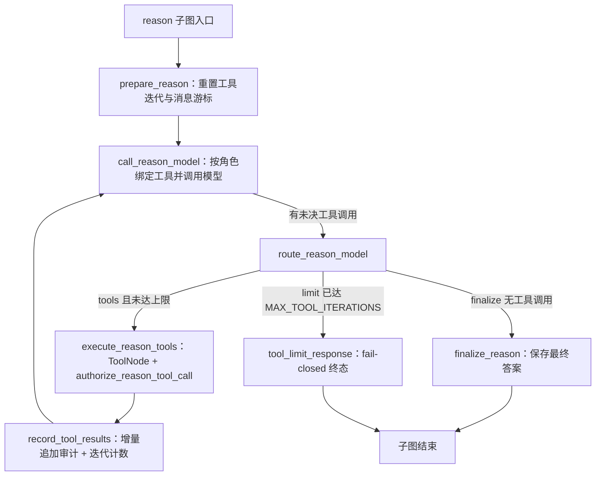
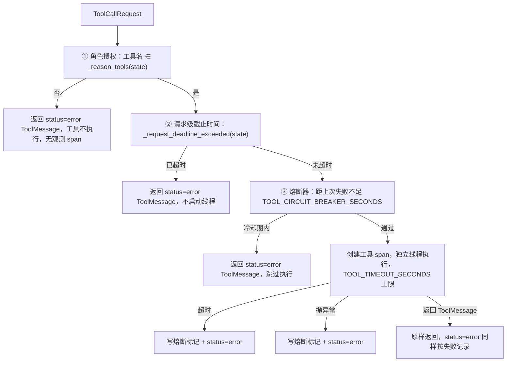

# Agent 工具边界：可见性、授权与执行保护

SecRAG 的 ReAct 推理不是“模型想调什么就调什么”。工具子系统由三层防御构成：**注册与可见性**（`src/agents/tools.py` 决定模型“看得见”哪些工具）、**执行边界授权**（`authorize_reason_tool_call` 在真正执行前再检查一次）、**审计与验证隔离**（`record_tool_results` 只把新增 ToolMessage 记入 `tool_calls`，失败输出不参与验证）。本页描述这三层的完整职责、控制流与不变量。

## 1. 角色：工具子系统在整条请求中的位置

外层 `StateGraph`（`src/agents/graph.py`）把 `reason` 作为一个聚合节点，其内部是独立的 ReAct 子图（`build_reason_subgraph`）。子图循环由五个节点组成：



ReAct 工具循环：`call_reason_model → execute_reason_tools → record_tool_results` 回环到模型，直到模型不再请求工具、超过 `MAX_TOOL_ITERATIONS`（3 次）或请求级截止时间触发短路。

关键构造点：

- `ToolNode(tools, wrap_tool_call=authorize_reason_tool_call)`：子图把**完整工具注册表**（`src/agents/tools.py` 的 `tools` 列表）交给 LangGraph 的 `ToolNode`，但每个工具调用在真正执行前都会经过 `authorize_reason_tool_call` 包装器。模型“看得见”的集合由绑定层限制（`_get_bound_reason_model` 按角色过滤），执行边界再做一次同等检查——两处都放行才会真正执行（`repo://src/agents/graph.py#L291-L322`）。
- `prepare_reason` 每次尝试重置 `tool_iterations` 为 0、记录 `reason_message_start` 与 `tool_message_cursor`，并写入 `reason_started_perf_counter` 供耗时追踪；验证失败重推时把上次验证的 issues 拼进用户消息（`repo://src/agents/nodes.py#L1145-L1183`）。
- `route_reason_model` 在每次模型响应后路由：无工具调用走 `finalize`，`tool_iterations >= MAX_TOOL_ITERATIONS` 时走 `limit`（fail-closed，不执行任何工具），否则走 `tools`（`repo://src/agents/nodes.py#L1346-L1357`）。

## 2. 可见性：get_tools_for_role 与“反转默认放行”不变量

### 2.1 注册表与来源映射

`src/agents/tools.py` 的 `tools` 列表是 ReAct 子图使用的完整注册表：4 个知识检索工具（`product_search`、`regulation_search`、`report_search`、`faq_search`）加 6 个业务工具（`calculator`、`suitability_check`、`market_data_tool`、`sql_query_tool`、`financial_ratios_tool`、`rerank_tool`）（`repo://src/agents/tools.py#L150-L163`）。

两个映射决定可见性：

- `_RETRIEVAL_TOOL_SOURCES`：把检索类工具名映射到检索源枚举（`SOURCE_PRODUCT`、`SOURCE_REGULATION`、`SOURCE_REPORT`、`SOURCE_FAQ`、`SOURCE_SQL`）。注意 `sql_query_tool` 是检索类工具，其源是 `SOURCE_SQL`，而不是白名单成员（`repo://src/agents/tools.py#L165-L172`）。
- `_NON_RETRIEVAL_TOOL_WHITELIST`：非检索工具的共享白名单，当前包含 `calculator`、`suitability_check`、`market_data_tool`、`financial_ratios_tool`、`rerank_tool` 五个；环境不满足时对应工具会被从白名单剔除——`market_data_available()` 为假（未配置行情数据源）时剔除 `market_data_tool`（ISSUE-19），`reranker_available()`（FlagEmbedding 不可导入）为假时剔除 `rerank_tool`（ISSUE-10）（`repo://src/agents/tools.py#L176-L183`、`repo://src/tools/market_data.py#L30-L40`、`repo://src/tools/rerank.py#L33-L43`）。

### 2.2 过滤规则

`get_tools_for_role(user_role, excluded_retrieval_sources=None)` 返回该角色对 ReAct 代理可见的工具列表，规则是：

```text
可见 =
  (工具是检索工具 AND 其来源 ∈ ROLE_ALLOWED_SOURCES[角色]
    AND 其来源 ∉ excluded_retrieval_sources)
  OR 工具名 ∈ _NON_RETRIEVAL_TOOL_WHITELIST
```

（`repo://src/agents/tools.py#L185-L208`）

三个推论：

1. **检索工具按角色数据源过滤**。`ROLE_ALLOWED_SOURCES`（`repo://src/schemas/constants.py#L310-L316`）规定：advisor/institutional_sales 可见 product/regulation/report/sql；compliance 额外可见 faq；operations/technical 可见 product/regulation/report/faq 但**不可见 sql**。因此 `sql_query_tool` 对 operations/technical 角色不可见，`faq_search` 对 advisor 不可见。
2. **排除外层图已满足的检索源**。`_reason_tools(state)` 调用 `_excluded_retrieval_sources`：只要本轮存在未被拒绝的检索结果，就把 `retrieval_plan` 里所有来源作为排除集，对应检索工具从模型绑定中移除，避免重复检索（`repo://src/agents/nodes.py#L1110-L1144`）。该排除同时作用于 `_get_bound_reason_model`（按 `(role, excluded_sources)` 做 `lru_cache`，缓存不可变绑定）与执行边界的 `_reason_tools`（`repo://src/agents/nodes.py#L1126-L1144`）。
3. **反转默认放行（P0-3）**：未在 `_RETRIEVAL_TOOL_SOURCES` 或 `_NON_RETRIEVAL_TOOL_WHITELIST` 声明的新工具，默认对所有角色不可见——包括未知角色 `"unknown"`。`test_unregistered_tool_is_hidden_by_default` 直接把一个 `rogue_tool` 追加进 `tools` 列表后断言它在任何角色下都不可见（`repo://tests/test_agents.py#L1440-L1455`）。这是“漏配即拒绝”的设计：可见性层与执行授权层用同一份白名单，杜绝“模型看得见但执行时被拒”或“两处配置漂移放行”的中间态。

### 2.3 绑定与执行使用同一可见性

`_get_bound_reason_model` 用 `get_tools_for_role` 的结果做 `llm.bind_tools(tools)`，所以模型只能看到可见工具；`authorize_reason_tool_call` 第一重检查又用 `_reason_tools(state)` 的同一可见集合做白名单。`test_reason_rejects_tool_hidden_from_role` 验证对角色隐藏的工具在执行边界被拒（`repo://tests/test_agents.py#L1664-L1697`）。

## 3. 执行边界：authorize_reason_tool_call 的四重检查

`authorize_reason_tool_call(request, execute)` 是 `ToolNode` 的 `wrap_tool_call`，在工具真正执行前按顺序检查四道防线（`repo://src/agents/nodes.py#L1231-L1323`）：



执行边界四重检查：角色授权 → 请求级截止时间 → 60 秒熔断器 → 10 秒单工具超时；前两重失败时不启动任何执行线程，第三重失败时跳过执行。

### 3.1 ① 角色授权

`allowed_names = {tool.name for tool in _reason_tools(state)}`，工具名不在集合内就返回“当前角色或检索计划无权调用该工具。”的 `status="error"` ToolMessage。**工具不执行**（`execute` 回调不会被调用），并且因为工具 span 在授权通过之后才创建，越权调用不产生任何观测数据（`repo://src/agents/nodes.py#L1237-L1258`）。`TC-023` 用 advisor 调用 `faq_search` 验证：返回错误 ToolMessage 且记录器断言 `executed == []`（`repo://tests/e2e/test_e2e_qa.py#L406-L462`）。

### 3.2 ② 请求级截止时间优先于单工具超时

`_request_deadline_exceeded(state)` 读取 `STATE_REQUEST_DEADLINE`（`time.monotonic` 秒，由 `src/api/auth.py` 初始化为 `time.monotonic() + config.api_request_timeout_seconds`，缺省表示无截止）（`repo://src/agents/nodes.py#L225-L230`、`repo://src/api/auth.py#L150-L155`）。已超时时直接返回超时错误 ToolMessage，**不启动执行线程**。同一截止时间也在 `call_reason_model` 里检查——请求超时后不再调用模型，用一条无工具调用的 AIMessage 短路到 finalize，让终态、会话保存与审计照常收敛（`repo://src/agents/nodes.py#L1195-L1200`）。`test_request_deadline_blocks_tool_execution` 断言截止时间过后 `execute` 根本不会被调用（`repo://tests/test_tool_deadline.py#L57-L74`）。

### 3.3 ③ 熔断器（60 秒冷却）

`_tool_circuit_breaker: dict[str, float]` 记录每个工具最后一次失败（超时或异常）的 `time.time()`；`now - last_failure < TOOL_CIRCUIT_BREAKER_SECONDS`（60 秒）时，冷却期内直接返回“工具已暂时熔断”的错误 ToolMessage，跳过执行（`repo://src/agents/nodes.py#L219`、`repo://src/agents/nodes.py#L1258-L1275`、`repo://src/schemas/constants.py#L113`）。熔断是进程级模块字典，`TC-023` 用 0.05 秒超时触发熔断后，第二次调用断言工具不再执行（`repo://tests/e2e/test_e2e_qa.py#L464-L502`）。

### 3.4 ④ 单工具超时（10 秒独立线程）

工具在 `ThreadPoolExecutor(max_workers=1)` 中执行，`future.result(timeout=TOOL_TIMEOUT_SECONDS)`（10 秒）超时即返回超时错误并写熔断标记（`repo://src/agents/nodes.py#L1279-L1296`、`repo://src/schemas/constants.py#L112`）。两个实现细节：

- **不能用 `with ThreadPoolExecutor` 上下文**：上下文退出会 `join` 残留线程，把等待时间拉长为任务实际耗时而非超时上限。当前实现先 `executor.shutdown(wait=False, cancel_futures=True)` 立即释放调用方，并把 executor 记入模块级 `_tool_executors` 集合防止超时后被 GC 导致异常（`repo://src/agents/nodes.py#L222`、`repo://src/agents/nodes.py#L1317-L1321`）。`test_tool_timeout_returns_promptly` 断言整体返回时间接近超时上限而非任务耗时（`repo://tests/test_tool_deadline.py#L35-L54`）。
- **异常也转错误 ToolMessage**：`execute` 抛出的任何异常都被捕获，返回 `status="error"` 的“工具调用失败: {exc}”，并同样写熔断标记（`repo://src/agents/nodes.py#L1297-L1310`）。工具业务错误以异常上抛（P0-2）正是依赖这一层：`sql_query_tool`、`market_data_tool`、`financial_ratios_tool` 在非法输入/非法 SQL/数据源故障时抛 `ValueError`/`RuntimeError`，由执行链路统一转成错误 ToolMessage，避免错误文本被当成查询结果证据（`repo://src/tools/sql_query.py#L140-L150`、`repo://src/tools/market_data.py#L108-L124`、`repo://tests/test_agents.py#L2605-L2652`）。

### 3.5 工具自身业务错误与异常上抛的分工

少数工具把“业务上无数据”当作正常结果返回，而不是抛异常：`suitability_check` 对缺失主数据返回 `matched: False` 的 JSON 载荷；`financial_ratios_tool` 对“库/表不存在”返回 `missing: True` 的载荷；`calculator` 与 `rerank_tool` 对解析类错误返回带“计算错误/重排序错误”前缀的字符串。这些是工具层显式设计的业务语义，与执行链路的异常转换正交（`repo://src/tools/suitability.py#L30-L39`、`repo://src/tools/financial_ratios.py#L67-L76`、`repo://src/tools/calculator.py#L96-L103`）。

## 4. 审计语义：record_tool_results 只追加、失败即记错

`record_tool_results(state)` 是 execute 之后、回环到模型之前的固定节点（`repo://src/agents/graph.py#L315-L316`），职责是**把自上次游标以来新增的 ToolMessage 增量追加进 `STATE_TOOL_CALLS`**（`repo://src/agents/nodes.py#L1324-L1344`）：

- **增量游标**：`STATE_TOOL_MESSAGE_CURSOR` 记录已消费的消息位置；节点从 `messages[cursor:]` 中筛选 `ToolMessage`，每条转为 `ToolCallDict(tool=message.name, output=content, success=message.status != "error")`，随后把游标推进到 `len(messages)`。`tool_limit_response` 生成的限流 ToolMessage 也按同样格式以 `success=False` 追加（`repo://src/agents/nodes.py#L1381-L1420`）。
- **失败语义**：`status="error"` 的 ToolMessage 记为 `success=False`。越权拒绝、截止时间短路、熔断拒绝、超时、异常转换、工具自身返回的 error ToolMessage 全部落入这一语义（`repo://tests/test_agents.py#L2605-L2624`）。
- **迭代计数**：每次 `record_tool_results` 把 `STATE_TOOL_ITERATIONS` 加 1，`route_reason_model` 用它判断是否触发 `limit`（`repo://src/agents/nodes.py#L1346-L1357`）。
- **审计落库**：`AuditLogger` 把 `STATE_TOOL_CALLS` 整体写入 `AuditReasoning.tool_calls`，随审计条目落 SQLite，供合规追溯（`repo://src/utils/audit.py#L131-L137`）。

## 5. 失败工具输出不参与验证（与 verifier 的边界）

`record_tool_results` 的 `success` 标记不只是审计字段，它还决定工具输出能否成为验证证据。`verify` 节点把 `STATE_TOOL_CALLS` 交给 `ComprehensiveVerifier`，其中：

- `NumberVerifier` 只把 `success=True` 的工具输出并入证据文本（`str(call.get("output", "")) for call in tool_calls if call.get("success", False)`）（`repo://src/utils/verifier.py#L237-L248`）。
- `HallucinationDetector` 同样只把成功输出当作证据，且仅结构化输出参与结构化声明比对（`repo://src/utils/verifier.py#L496-L515`）。

因此，`status="error"` 的工具输出——包括 SQL 拒绝文本、超时消息、熔断消息——不会被当成数据证据。`tests/test_verifier_boundaries.py` 的 `TestFailedToolOutputNotEvidence` 用“查询错误: 目标价 88.88 元”做对照：同一段文本在 `success=False` 时数字验证与幻觉检测均失败，在 `success=True` 时才通过（`repo://tests/test_verifier_boundaries.py#L174-L213`）。这也解释了 3.4 的异常上抛设计：如果工具把错误吞成普通字符串返回，ToolMessage 状态为成功，验证器就会把错误文本当证据（`repo://tests/test_agents.py#L2605-L2624`）。

## 6. 请求级截止时间的联动短路

`STATE_REQUEST_DEADLINE` 由 `src/api/auth.py` 写入状态（`time.monotonic() + api_request_timeout_seconds`，默认 60 秒）（`repo://src/api/auth.py#L150-L155`、`repo://src/config.py#L66`）。ReAct 子图在两个执行点检查它：

1. `call_reason_model`：已超时则不再调用模型，直接追加“请求处理已超时”的 AIMessage 短路到 finalize（`repo://src/agents/nodes.py#L1195-L1200`）。
2. `authorize_reason_tool_call`：已超时则返回超时错误 ToolMessage，不启动执行线程（`repo://src/agents/nodes.py#L1251-L1258`）。

两者配合保证：即使单工具超时上限（10 秒）小于请求级截止，整条请求也不会在截止时间后继续发起新的模型调用或工具执行；短路产生的消息仍会走 `record_tool_results` 与审计，终态收敛不丢失（`repo://tests/test_tool_deadline.py#L57-L74`）。

## 7. 失败语义与 fail-closed 汇总

工具子系统所有失败路径都收敛为 `status="error"` 的 ToolMessage，`record_tool_results` 记 `success=False`，验证器拒绝将其作为证据：

| 失败路径 | 触发点 | 结果 |
| --- | --- | --- |
| 角色越权 | 授权检查 ① | error ToolMessage，工具不执行，无观测 span |
| 请求级截止 | 检查 ② 或 `call_reason_model` | error ToolMessage / 无工具调用 AIMessage |
| 熔断冷却期 | 检查 ③ | error ToolMessage，跳过执行 |
| 单工具超时 | 检查 ④ | error ToolMessage + 写熔断标记 |
| 工具抛异常 | 检查 ④ | error ToolMessage + 写熔断标记 |
| 工具迭代超限 | `route_reason_model` / `tool_limit_response` | fail-closed 终态，未决调用记 `success=False` |

单次工具调用最多消耗一个超时上限（10 秒）的等待时间；同一工具在 60 秒冷却期内不再执行。新增工具的安全契约是：要么把名字加入 `_NON_RETRIEVAL_TOOL_WHITELIST`（对所有角色可见），要么加入 `_RETRIEVAL_TOOL_SOURCES` 并配合 `ROLE_ALLOWED_SOURCES`（按角色按源可见）——两者都不做则默认不可见（反转默认放行，`repo://src/agents/tools.py#L165-L208`）；环境能力不足时（无行情数据源、无 FlagEmbedding）对应工具同样对模型隐藏，模型不会反复调用注定失败的工具。
