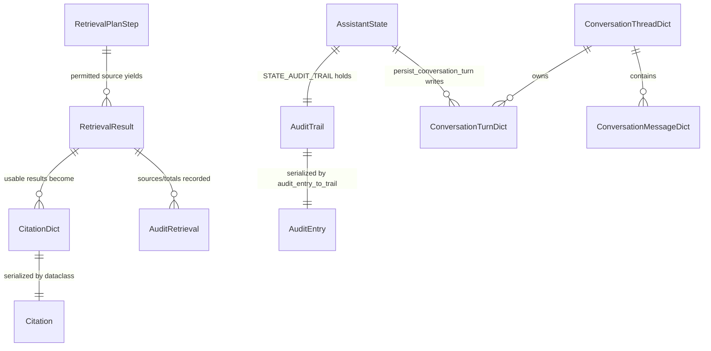

# 共享模式：字段常量、TypedDict 与 AssistantState

`src/schemas/` 是 SecRAG 的“字段宪法”：`constants.py` 定义所有硬编码字符串字段名、枚举值和配置阈值的唯一权威；`typed_dicts.py` 定义 Agent 状态与序列化载荷的结构形状；`models.py` 定义权威 dataclass（`Citation`、`AuditEntry`）。`src/agents/state.py` 的 `AssistantState` 是 LangGraph Agent 图的共享内存，其键名必须与 `STATE_*` 常量一一对应。

```text
constants.py ──常量/枚举/阈值──► 所有模块（nodes / retrieval / api / utils / ingestion）
      │
      └──STATE_* 键名──约定同步──► state.py 的 AssistantState（TypedDict 字面量键）
                                        │
                                        └──typed_dicts.py（字段结构形状）
                                        └──models.py（Citation / AuditEntry dataclass）
```

## 1. 为什么需要单一权威

`src/schemas/constants.py` 的文件头直接声明了项目约定：

- 本文件是项目中所有硬编码字符串字段名的**唯一权威来源**；
- 任何模块不得直接使用裸字符串作为 metadata key / State key / 枚举值；
- 定义与 `SCHEMA-REFERENCE.md` 中的章节一一对应。

代码中随处可见这一约定：`nodes.py`、`hybrid_retriever.py`、`audit.py`、`conversation.py`、`verifier.py`、`formatter.py`、`auth.py`、`result_cache.py` 等一律 `from src.schemas.constants import ...`。测试也遵守同一约定（如 `tests/test_agents.py` 直接引用 `STATE_*`、`PLAN_*`、`RR_*`、`AUDIT_*` 常量构造状态）。

这样做的直接收益：字段重命名只需改 `constants.py` 一处；权限枚举（如 `PERMISSION_INTERNAL`）在入库校验（`ingestion/identity.py`）与检索过滤（`hybrid_retriever.py`）两端引用同一个常量，不会漂移。

## 2. 常量组的权威清单

以下常量组均定义于 `src/schemas/constants.py`，按文件内章节顺序列出。

### 2.1 metadata 字段键名（`META_*`，SCHEMA-REFERENCE §1.1）

Chunk 元数据的键，由入库侧写入、检索与审计侧读取：

| 键 | 值 | 用途 |
| --- | --- | --- |
| `META_CHUNK_ID` | `chunk_id` | chunk 稳定身份，RRF 去重 key 之一 |
| `META_DOC_ID` | `doc_id` | 文档稳定身份 |
| `META_DOC_TYPE` | `doc_type` | 文档类型，见 §3.1 |
| `META_SOURCE` | `source` | 来源（文件路径/URL），结果级权限过滤、引用展示 |
| `META_TITLE` | `title` | 文档标题，prompt 与引用展示 |
| `META_DATE` | `date` | 来源日期 |
| `META_DATE_DAY` | `date_day` | 数值日期 yyyymmdd，供 Chroma 数值范围过滤 |
| `META_STOCK_CODE` | `stock_code` | 股票代码，研报检索过滤 |
| `META_PERMISSION_LEVEL` | `permission_level` | 权限级别，见 §3.4 |
| `META_PAGE_NUMBER` | `page_number` | 页码 |
| `META_PRODUCT_TYPE` | `product_type` | 产品类型 |
| `META_ERROR` | `error` | 检索错误信息 |
| `META_ALLOWED_ROLES` | `allowed_roles` | 允许访问的角色列表 |
| `META_RETRIEVAL_SOURCE` | `retrieval_source` | 逻辑检索源名（如 `report_search`），BM25 前置过滤用 |
| `META_FILE_HASH` / `META_METADATA_HASH` / `META_PARSE_HASH` / `META_CHUNK_HASH` | 各类哈希 | 入库 registry 快照与增量判断 |
| `META_CHUNK_INDEX` | `chunk_index` | chunk 序号 |
| `META_DOC_VERSION` | `doc_version` | 文档版本 |
| `META_INGESTED_AT` | `ingested_at` | 入库时间 |
| `META_PARSER_VERSION` / `META_CHUNKER_VERSION` / `META_EMBEDDING_MODEL` | 版本号 | 处理链版本追踪 |

### 2.2 检索分数语义分离（issues.md 一.5）

`RR_SCORE`（`score`）在不同阶段含义不同：向量相似度、BM25 原始分或 rerank 分。原始量纲分别保存在 metadata 中：

- `META_VECTOR_SCORE`（`vector_score`）
- `META_BM25_SCORE`（`bm25_score`）
- `META_RRF_SCORE`（`rrf_score`）——RRF 融合分单独存放

排序时每阶段只用一种量纲：`grade_and_filter` 的 `_comparable_retrieval_scores` 对融合结果直接用 `rrf_score`，对未融合结果按 cosine 排名折算成 RRF 等值分 `1/(RRF_K+rank+1)`，与 `rrf_fuse` 共用 `RRF_K`，否则混合池里融合结果会被系统性压底。

### 2.3 retrieval_results 与 retrieval_plan 键名（`RR_*` / `PLAN_*`）

`RetrievalResult` 键：`RR_CONTENT`（`content`）、`RR_METADATA`（`metadata`）、`RR_SCORE`（`score`）、`RR_DENIED`（`denied`）、`RR_REASON`（`reason`）。

`RetrievalPlanStep` 键：`PLAN_SOURCE`（`source`）、`PLAN_QUERY`（`query`）、`PLAN_TOP_K`（`top_k`）、`PLAN_FILTERS`（`filters`）、`PLAN_DENIED`（`denied`）、`PLAN_REASON`（`reason`）。

### 2.4 AssistantState 字段键名（`STATE_*`，SCHEMA-REFERENCE §3.7）

约六十个 `STATE_*` 常量，覆盖九组字段（用户上下文、会话上下文、查询理解与安全标记、检索计划、检索结果、推理过程、验证与合规、最终回答、追踪）。几个关键语义：

- `STATE_TERMINAL`（`terminal`）：`True` 表示该节点输出是对外业务终态。`compose`、`clarify`、`permission_denied_response` 置 `True`；ReAct 尝试产出的中间 `final_answer`（`finalize_reason`）不带此标记。SSE 传输层据此识别终态事件，不按节点名推断。
- `STATE_REQUEST_DEADLINE`（`request_deadline`）：请求级截止时间（`time.monotonic` 秒），由 `build_assistant_initial_state` 写入 `time.monotonic() + config.api_request_timeout_seconds`；模型调用与工具执行点检查，超时尽快短路。
- `STATE_RERANKER_STATUS`（`reranker_status`）：值域 `"applied" | "unavailable" | "error:<msg>"`，`compose` 用它参与置信度判定。
- `STATE_QUERY_SANITIZED`（`query_sanitized`）：bool，查询命中注入指令并已加固时为 `True`。
- `STATE_CLARIFICATION_NEEDED`、`STATE_PII_DETECTED`、`STATE_LANGUAGE`：查询理解产出的澄清/安全/语言标记。
- `STATE_VERIFICATION_ATTEMPTS`（`verification_attempts`，ISSUE-25）：每轮 reason 的验证快照列表 `{round, passed, failure_kind, issues, confidence}`，随审计持久化。
- `STATE_LLM_USAGE`（`llm_usage`，ISSUE-23）：当前节点一次 LLM 调用的 `prompt_tokens/completion_tokens/total_tokens` 计量，落审计后可按请求区分 prefill 与 completion 开销。
- `STATE_RETRIEVAL_WIDENING`（`retrieval_widening`，ISSUE-24）：低召回放宽轮计数；`retrieve` 节点据此把计划 top_k 按倍率放大重跑。
- `STATE_RETRIEVAL_PLAN_RAW`（`retrieval_plan_raw`）：`query_understand` 合并产出未规范化的原始计划，`planner` 节点负责规范化成 `RetrievalPlanStep`。

### 2.5 配置阈值与默认值（SCHEMA-REFERENCE §4）

| 常量 | 值 | 图路由 / 验证中的用途 |
| --- | --- | --- |
| `MAX_QUERY_LENGTH` | 500 | `query_understand` 先截断超长查询（`sanitize_query`）再送 LLM |
| `MAX_PROMPT_TOKENS` | 4000 | `_build_reason_system_prompt` 的证据预算上限（固定部分开销后逐条加入检索结果） |
| `MAX_CHAT_HISTORY_TURNS` | 6 | 对话历史保留最近轮数 |
| `TOOL_TIMEOUT_SECONDS` | 10.0 | `authorize_reason_tool_call` 单工具超时，超时触发熔断 |
| `TOOL_CIRCUIT_BREAKER_SECONDS` | 60.0 | 工具熔断冷却期，期内跳过已知失败工具 |
| `RETRIEVAL_CACHE_TTL_SECONDS` | 300.0 | 进程内检索结果 TTL 缓存（`result_cache.py`） |
| `DEFAULT_TOP_K` | 5 | 计划步骤默认 `top_k` |
| `PERMISSION_OVERFETCH_FACTOR` | 3 | 权限感知检索先超量取回 `top_k × 3` 候选，结果级过滤后再截断，避免高分候选全越权时误判 |
| `DEFAULT_MAX_HOPS` | 3 | `should_retry_retrieval`：多跳检索上限，达到后继续向下 |
| `MAX_REASON_ATTEMPTS` | 2 | `should_reason_again`：验证失败重推 ReAct 的上限 |
| `MAX_TOOL_ITERATIONS` | 3 | `route_reason_model`：单次 ReAct 尝试的工具循环上限，超出走 `tool_limit_response` |
| `AGENT_RECURSION_LIMIT` | 50 | API 层 LangGraph `recursion_limit` |
| `GRADE_TOP_K` | 10 | `grade_and_filter` 语义重排后保留条数（候选池限 `GRADE_TOP_K × 2` 控制 rerank 开销） |
| `CONFIDENCE_HIGH_THRESHOLD` | 0.75 | 规则版置信度：最高分达到该阈值且结果数足够才为 high |
| `CONFIDENCE_MEDIUM_THRESHOLD` | 0.5 | 最高分达到该阈值为 medium，否则 low |
| `CONFIDENCE_HIGH_MIN_RESULTS` | 3 | 高置信所需最少结果数（`compose` 置信度与 `formatter.py` 规则版置信度使用） |
| `RETRIEVAL_SUFFICIENT_RESULTS` | 2 | `should_retry_retrieval` 的回环阈值（ISSUE-12）：已有 2 条可用结果即不再补检，避免为置信度评级硬凑证据数 |
| `WIDEN_TOP_K_FACTOR` / `MAX_WIDEN_TOP_K` | 2 / 20 | 低召回放宽轮（ISSUE-24）的 top_k 倍率与上限（定义于 `nodes.py` 模块常量） |
| `RETRIEVAL_MIN_SCORE` | 0.6 | `grade_and_filter` 阈值过滤：只适用于未融合结果的原始 score；RRF 分数量纲不同，不得用同一阈值 |
| `RRF_K` | 60 | RRF 融合常数；`rrf_fuse` 与 `grade_and_filter` 的未融合结果等值折算必须共用，否则两处分数不可比 |

### 2.6 基础设施默认值

- Chroma：集合名 `CHROMA_COLLECTION_NAME = "securities_docs"`、持久目录 `./data/chroma`、`hnsw:space=cosine`、批量 5000。
- SQLite 路径：`data/financial.db`、`data/audit.db`、`data/conversations.db`、`data/ingest_registry.db`。
- API 路由：`/v1/assistant/qa`、`/v1/assistant/qa/stream`、`/v1/assistant/threads`、`/v1/assistant/threads/{thread_id}`、`/v1/assistant/threads/{thread_id}/messages`、`/v1/admin/ingestion/*`。
- Embedding 默认模型 `BAAI/bge-m3`（运行时配置默认 `BAAI/bge-small-zh-v1.5`）；LLM 默认 OpenAI 兼容端点与模型、Ollama 默认地址与模型、温度 `LLM_DEFAULT_TEMPERATURE=0.1`。
- 入库任务状态与错误码：`INGEST_RUN_STATUS_QUEUED/RUNNING/SUCCESS/FAILED` 与 `INGEST_ERROR_*` 五个错误码。

## 3. 枚举值域

### 3.1 doc_type（SCHEMA-REFERENCE §2.1）

`research_report`、`announcement`、`regulation`、`financial_data`、`meeting_minutes`、`product`、`faq`；`ALL_VALID_DOC_TYPES` 集合在入库目录/清单校验中使用。

### 3.2 用户角色（SCHEMA-REFERENCE §2.2）

`advisor`、`institutional_sales`、`compliance`、`operations`、`technical`；`UserRole` 是相应的 Literal 类型。

### 3.3 confidence（SCHEMA-REFERENCE §2.3）

`high`、`medium`、`low`；`Confidence` 为 Literal 类型。

### 3.4 permission_level（SCHEMA-REFERENCE §2.4）

`public`、`internal`、`confidential`。默认安全：`hybrid_retriever` 对缺少该字段的 metadata 视为 `public`；非公开 chunk 缺少 `allowed_roles` 时默认拒绝。

### 3.5 query_type（SCHEMA-REFERENCE §2.5）

`product_inquiry`、`rule_inquiry`、`regulation_inquiry`、`report_inquiry`、`faq_inquiry`、`technical_inquiry`；`QueryType` 为 Literal 类型。

### 3.6 retrieval_source（SCHEMA-REFERENCE §2.6）

`product_search`、`regulation_search`、`report_search`、`faq_search`、`sql_query`。`DOC_TYPE_RETRIEVAL_SOURCES` 建立 doc_type → retrieval_source 映射，入库校验 retrieval_source 与 doc_type 必须匹配；BM25 来源过滤用 `retrieval_source` 精确匹配而非 `metadata.source`（文件路径/URL）。

### 3.7 角色 → 检索源 / 数据权限映射（SCHEMA-REFERENCE §5）

- `ROLE_ALLOWED_SOURCES`：advisor/sales 可用 product、regulation、report、SQL；compliance 额外加 FAQ；operations/technical 用 product、regulation、report、FAQ。
- `ROLE_DATA_PERMISSIONS`：advisor/sales/operations 为 public+internal；compliance/technical 额外加 confidential。认证入口 `build_assistant_initial_state` 据此初始化 `data_permissions`。

### 3.8 LLM 提供方标识（SCHEMA-REFERENCE §2.7）

`openai`、`ollama`，由 `config.py` 的 `llm_provider` 切换。

## 4. AssistantState：LangGraph 的共享内存

`src/agents/state.py` 的 `AssistantState` 是 LangGraph Agent 图的全局状态：所有节点读写同一份状态，按 key 协作。文件头的注释明确写了同步约定：

> 每个 key 的字符串值必须与 `src/schemas/constants.py` 中的 `STATE_*` 常量一致。TypedDict 要求键名为字面量（Python 限制），无法直接引用常量作为键名；作为补偿，每个字段注释标注对应的 `STATE_*` 常量，新增/重命名时务必同步更新 constants.py。

字段分组（与 §2.4 的常量组一一对应）：

| 组 | 字段（TypedDict 键） |
| --- | --- |
| 用户上下文 | `user_id`、`user_role`、`department`、`data_permissions`、`client_id`、`thread_id`、`turn_id`、`turn_index` |
| 会话上下文 | `chat_history`（`list[ConversationMessageDict]`）、`conversation_summary`、`resolved_query` |
| 查询理解与安全标记 | `original_query`、`rewritten_query`、`intent`、`entities`（`QueryEntities`）、`ambiguity`、`query_type`、`query_sanitized`、`pii_detected`、`language` |
| 检索计划 | `retrieval_plan`（`list[RetrievalPlanStep]`）、`retrieval_plan_raw`、`retrieval_attempts`、`retrieval_widening` |
| 检索结果 | `retrieval_results`（`list[RetrievalResult]`）、`retrieval_total_chunks`、`retrieval_filtered_chunks`、`reranker_status` |
| 推理过程 | `messages`（`Annotated[Sequence[BaseMessage], add_messages]`）、`tool_calls`、`intermediate_steps`、`reason_attempts`、`tool_iterations`、`reason_message_start`、`tool_message_cursor`、`reason_started_perf_counter`、`request_deadline`、`llm_usage` |
| 验证与合规 | `verification`（`VerificationResult`，含 `retry_diagnosis`）、`verification_attempts`（每轮快照，ISSUE-25）、`compliance`（`ComplianceResult`） |
| 最终回答 | `final_answer`、`terminal`、`citations`（`list[CitationDict]`）、`confidence`、`risk_disclosure` |
| 追踪 | `audit_trail`（`AuditTrail`） |

节点的职责边界是“读状态、返回增量更新”：`AssistantState` 由 API 层 `build_assistant_initial_state` 一次性初始化（身份、数据权限、原始查询、空集合与 `STATE_REQUEST_DEADLINE`），图节点各自读取所需字段并返回要合并的键。`messages` 使用 LangGraph 的 `add_messages` reducer 做消息合并；其余字段由节点显式累加或替换（如 `retrieve` 把本轮结果 `accumulated = state.get(...) + results` 累加到已有结果上）。

## 5. AuditTrail 与 AuditEntry：追踪字段的权威结构

`AUDIT_*` 常量（SCHEMA-REFERENCE §3.5）定义 `audit_trail` 的字段键，分为五个子对象：

- `AUDIT_QUERY_*`：`original`、`rewritten`、`intent`、`query_type`、`entities`、`sanitized`、`pii`、`language`；
- `AUDIT_RETRIEVAL_*`：`plan`、`sources`、`total_chunks`、`filtered_chunks`；
- `AUDIT_REASONING_*`：`tool_calls`、`iterations`、`duration_ms`、`execution_path`、`node_timings`；
- `AUDIT_RESPONSE_*`：`citations`、`confidence`、`risk_disclosure`；
- 顶层：`AUDIT_REQUEST_ID`、`AUDIT_TIMESTAMP`、`AUDIT_STARTED_PERF_COUNTER`（`_started_perf_counter`）与 `AUDIT_TOTAL_DURATION_MS`。

对应的 TypedDict 为 `AuditQuery`、`AuditRetrieval`、`AuditReasoning`、`AuditResponse`、`AuditTrail`（`typed_dicts.py`）；`src/utils/audit.py` 的 `AuditEntry` dataclass 以 SCHEMA-REFERENCE §3.5 为权威，是审计记录的完整结构（比 state 中的 trail 多了 `user_id`/`user_role`/`department` 等身份字段）。两个转换点：

- `audit_entry_to_trail(entry)` 把 `AuditEntry` 序列化成 `AuditTrail`（state 中的形状）；
- `AuditLogger.log(state)` 从 `AssistantState` 组装 `AuditEntry`，其中 `retrieval.sources` 由 `_unique_sources` 从结果 metadata 去重提取，`reasoning.iterations`/`duration_ms` 由 `intermediate_steps` 中 `step == "reason"` 的记录聚合。

`SQLiteAuditStore.insert` 落盘时把 `payload_json`（完整 `AuditTrail`）与 `request_id`、时间戳、用户、`query_text`、`compliance_passed`、`confidence` 列一起写入 `audit_entries` 表。写入失败不阻断回答：`audit_log` 节点把对话 outbox 标记失败、追加 `data/audit_outbox.jsonl`，并在 trail 中标记 `audit_write_failed`/`audit_write_error` 后返回降级 trail。

## 6. 核心数据形状之间的关系



一句话串联：`planner` 产出 `RetrievalPlanStep` 列表存入 `STATE_RETRIEVAL_PLAN`；`HybridRetriever` 按计划执行并返回 `RetrievalResult`（`content`/`metadata`/`score`，越权时 `denied`/`reason`）累加到 `STATE_RETRIEVAL_RESULTS`；`extract_citations` 只从非 denied 结果生成 `CitationDict`（内部由 `Citation` dataclass 构造、`asdict` 序列化）；`compose` 组装 `final_answer`/`confidence`/`risk_disclosure`；`persist_conversation_turn` 把可见消息、turn 摘要（含 entities/citations）与审计 outbox 事件写入会话库；`audit_log` 用 `AuditLogger` 把整条链路的 `AuditTrail` 写入审计库。`AssistantQAResponse`（`request_response.py`）是 `AnswerOutcome` 的序列化投影，只含 `thread_id`/`turn_id`/`answer`/`citations`/`confidence`/`compliance`，内部审计数据不外露。

## 7. 不变量与失效语义

- **字段名不变量**：任何模块不得出现裸字符串字段名；`state.py` 的每个 TypedDict 键必须与同名 `STATE_*` 常量一致（Python 不允许常量作键名，用注释标注对应关系作为补偿）；新增/重命名键必须同时改 `constants.py` 与 `state.py`。
- **枚举不变量**：`allowed_roles` 必须来自 `UserRole` 值域，`permission_level` 必须来自 `PERMISSION_*` 值域，`retrieval_source` 必须与 `doc_type` 匹配（`ingestion/identity.py` 在入库前校验，非法值直接失败）。
- **分数量纲不变量**：`RETRIEVAL_MIN_SCORE` 只过滤未融合结果的原始 score；`rrf_score` 与未融合结果的 RRF 等值折算共用 `RRF_K`，任何一处改 k 必须同步另一处。
- **终态标记不变量**：只有对外业务终态节点（`compose`、`clarify`、`permission_denied_response`）置 `STATE_TERMINAL=True`；ReAct 中间 `final_answer` 不带标记，SSE 传输层按此区分。
- **权限拒绝语义**：越权 source 不静默跳过，而是转为显式 `denied=True` 的 `RetrievalResult`/`RetrievalPlanStep`，让上层能提示“部分结果无权查看”；全部 denied 时 `permission_denied_response` 在 LLM 推理前短路。
- **回环阈值分离**：`RETRIEVAL_SUFFICIENT_RESULTS`（回环阈值，2）与 `CONFIDENCE_HIGH_MIN_RESULTS`（置信度评级所需证据数，3）是两个决策（ISSUE-12）；非 0 低召回走 widen 放宽轮而非重新规划（ISSUE-24）。

## 8. 关键实现点与相关测试

- 常量→枚举的 Literal 类型（`UserRole`、`Confidence`、`QueryType`）直接在 `constants.py` 定义，`state.py` 的注释引用它们作为字段值域说明。
- `formatter.py`（开发版 RAG 路由）用 `CONFIDENCE_HIGH_THRESHOLD`/`CONFIDENCE_MEDIUM_THRESHOLD`/`CONFIDENCE_HIGH_MIN_RESULTS` 做规则版置信度；Agent 主链路 `compose` 用验证结果 + 有效结果数（≥3）+ `reranker_status == "applied"` 判定。
- 聚焦测试：`tests/test_agents.py` 的 `TestGradeAndFilter` 覆盖阈值过滤、`GRADE_TOP_K` 截断、跨跳去重与 `retrieval_filtered_chunks` 计数；`tests/test_tool_deadline.py` 覆盖 `TOOL_TIMEOUT_SECONDS` 超时上限与 `STATE_REQUEST_DEADLINE` 短路；`tests/test_api_main.py` 覆盖 `AGENT_RECURSION_LIMIT` 传入与响应不暴露 audit_trail；`tests/test_hybrid_retriever.py` 覆盖计划级/结果级权限过滤与拒绝占位；`tests/test_conversation.py` 覆盖 `request_id` 幂等与线程隔离。

## 相关页面

<!-- openwiki: broken internal link [/openwiki/architecture/state-and-safety.md] link "/openwiki/architecture/state-and-safety.md" is root-absolute, which no real consumer resolves against the repository root (not a coding agent reading the page, not GitHub's Markdown renderer, not a local viewer); use a path relative to this file instead. Fix the href or restore the target, then delete this comment. -->
- [状态、权限与安全边界](/openwiki/architecture/state-and-safety.md)：`AssistantState` 贯穿节点与各层安全边界的运行时视角。
<!-- openwiki: broken internal link [/openwiki/tutorials/request-execution.md] link "/openwiki/tutorials/request-execution.md" is root-absolute, which no real consumer resolves against the repository root (not a coding agent reading the page, not GitHub's Markdown renderer, not a local viewer); use a path relative to this file instead. Fix the href or restore the target, then delete this comment. -->
- [问答请求执行链路](/openwiki/tutorials/request-execution.md)：从 HTTP 到最终答案的节点编排，逐节点消费的 state 键。
<!-- openwiki: broken internal link [/openwiki/tutorials/knowledge-ingestion.md] link "/openwiki/tutorials/knowledge-ingestion.md" is root-absolute, which no real consumer resolves against the repository root (not a coding agent reading the page, not GitHub's Markdown renderer, not a local viewer); use a path relative to this file instead. Fix the href or restore the target, then delete this comment. -->
- [知识入库链路](/openwiki/tutorials/knowledge-ingestion.md)：chunk metadata（`META_*`）如何写入并被权限感知检索消费。
