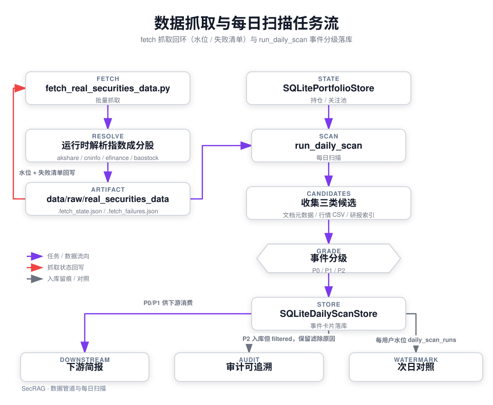

# 数据与离线作业：样例数据、证券数据抓取、持仓与每日扫描

SecRAG 的离线数据链是一条「抓取 → 产物目录 → 每日扫描 → 事件分级 → 落库」的批处理流水线，为在线问答与投研简报提供证券数据素材。它由三块组成：

1. **数据资产**：`data/raw/demo_knowledge_base/`（最小样例知识库）与 `data/raw/real_securities_data/`（公开来源证券数据固定样本）；
2. **抓取脚本**：`scripts/fetch_real_securities_data.py`，把公开数据源批量抓成带权限元数据的产物目录；
3. **每日扫描与持仓**：`src/portfolio/`（按用户隔离的持仓/关注池）与 `src/jobs/`（`run_daily_scan` 把产物按用户扫描成 P0/P1/P2 事件卡片）。

> ⚠️ 本页描述的是架构验证原型的数据链，不是生产系统。固定样本与 demo token 只能证明流程；事件分级阈值是启发式起点，未经真实标注数据标定。

## 1. 离线数据链总览



离线数据链：抓取脚本把公开数据写入产物目录并留下水位与失败清单；每日扫描按用户持仓把产物分级成事件卡片，P0/P1 供下游消费、P2 保留供审计，每次运行在 `scan.db` 留下按用户的水位。

## 2. 数据资产：`data/raw/` 的两组产物

### 2.1 `demo_knowledge_base/`：最小样例知识库

`data/raw/demo_knowledge_base/` 用于权限、检索和入库流程的最小验证：

- `samples/` 按分类目录（`product`、`regulation`、`faq`、`report`）存放极少量样例文档；
- `announcements/` 存放本地解析样例（PDF、docx、CSV）。

每个源文件旁边都有一个同名 `.meta.json` 权限清单，声明 `doc_type`、`retrieval_source`、`permission_level`、`allowed_roles`。这是入库预检的硬性要求：缺失清单、doc_type 非法或不属于所选分类的文件会进入预检失败清单而不入库（详见 [知识入库链路](../tutorials/knowledge-ingestion.md)）。

### 2.2 `real_securities_data/`：真实证券数据固定样本

`data/raw/real_securities_data/` 存放来自公开来源的财报、研报和结构化证券数据样本，目录结构如下：

- `announcements/`：年报 PDF 及其同名 `.meta.json`（cninfo，`permission_level=internal`，角色 `advisor/institutional_sales/compliance`）；
- `reports/`：研报 PDF 及其 `.meta.json`（akshare/eastmoney，`permission_level=public`，角色含 `operations/technical`）；
- `financials/`：行情/估值 CSV（`efinance_*_quote_history.csv`、`baostock_*_valuation.csv`）与共享的 `research_reports_index.csv`；
- 逐文件同名 `.meta.json` 边车：记录 doc_type、retrieval_source、permission_level、allowed_roles、title、date、stock_code、source、provider、sha256（整目录聚合清单 `metadata.json` 已停止跟踪并从仓库移除，产物清单以边车为准）。

当前固定样本是 2026-09 演练刷新的三只代表股（000001 / 300750 / 600519）的 2026 年报与配套数据（`63a7d66`）。

每个工件旁的同名 `.meta.json` 边车（sidecar）同时作为**内容哈希幂等**与**每日扫描文档候选**的依据。仓库固定这些样本，用于保证本地解析、入库与扫描验证不依赖实时抓取。`.fetch_state.json` / `.fetch_failures.json` 水位与失败清单是机器本地产物，已加入 `.gitignore` 不再入库。

## 3. 批量抓取：`scripts/fetch_real_securities_data.py`

抓取脚本把数据提供方库保持为可选依赖，核心运行时依赖不因此膨胀。运行命令：

```bash
uv run --with akshare --with efinance --with baostock \
  python scripts/fetch_real_securities_data.py
```

### 3.1 运行时成分股解析，不硬编码代码表

成分股列表在运行时从 `akshare.index_stock_cons(symbol=...)` 解析（默认指数 `000300`），代码中**没有硬编码股票代码表**——指数调仓时不会悄悄过期。列名通过候选字段表匹配（`品种代码/股票代码/证券代码/code` 与 `品种名称/股票名称/证券简称/name`）；**故意不做静默兜底列**：provider schema 漂移时直接抛 `RuntimeError` 失败出声，而不是猜错列继续跑。

### 3.2 内容哈希幂等

每个下载工件按 `sha256` 与边车 manifest 比对：若文件仍匹配记录的 `sha256`，`load_cached_record` 直接复用缓存记录，不重复下载。因此**重复执行不重复下载**，批次是增量的。

### 3.3 单标失败隔离

每只标的的每个阶段都经 `collect_target` 包裹，异常被转换成一条失败记录（`stock_code`、`stage`、`error`、`occurred_at`）写入 `.fetch_failures.json`，**单只标的失败不会中断整批**。批次结束后在产物目录留下 `.fetch_state.json` 水位，记录 `index_symbol`、`last_run_at`、`symbols_total`、`symbols_failed`、`artifacts`。

### 3.4 四种数据源与权限元数据

`run_batch` 顺序合并四个抓取步骤，每步都写边车清单：

- **年报**（`fetch_annual_reports`）：先经 cninfo topSearch 解析 `code,orgId`，再按关键词「年度报告」查询下载 PDF；
- **研报**（`fetch_research_reports`）：akshare `stock_research_report_em` 取首条研报，并把每只标的前 5 行汇入共享 `research_reports_index.csv`（作为 SQL 检索与每日扫描的研报候选）；
- **行情**（`fetch_quote_history`）：efinance `get_quote_history`，重命名列后写入 `efinance_<code>_quote_history.csv`；
- **估值**（`fetch_valuation_history`）：baostock `query_history_k_data_plus`，**整个批次共享一次 login/logout**，写入 `baostock_<code>_valuation.csv`。

`write_metadata` 为每个记录写 `<文件名>.meta.json` 边车，内含 `doc_type`、`retrieval_source`、`permission_level`、`allowed_roles`、`title`、`date`、`stock_code`、`source`、`provider`、`sha256`（研报额外含 `institution`、`rating`）。抓取下来的 PDF 会经 `ensure_pdf` 校验 `%PDF-` 魔数。

### 3.5 数据提供方契约风险

三个 provider 契约——akshare 成分股列名、cninfo orgId 解析、efinance 与 baostock 返回值——**未在联网环境实机核对**。契约不符之处体现为失败清单（`.fetch_failures.json`），不会提前报错；仓库固定样本用于本地验证。

## 4. 持仓与关注池：`SQLitePortfolioStore`

`src/portfolio/store.py` 的 `SQLitePortfolioStore` 负责每位用户自己的持仓与关注标的，所有读写按 `user_id` 隔离。设计要点：

- **越权按不存在处理**：`_find_row` 用 `position_id AND user_id` 查询，命中不到时抛 `PortfolioNotFoundError`——调用方无法探测其他用户的持仓存在性；
- **一张表区分持仓与关注池**：`position_side` 取 `long`（持仓）或 `watch`（关注），共享同一存储结构；
- **软删除**：`remove_position` 置 `deleted_at` 与 `status=deleted`；重新 `add_position` 会**复活旧行**（复用 `position_id`）而不是复制；
- **约束**：同一用户同一 side 的活跃重复标的抛 `DuplicatePositionError`；`weight` 必须在 `[0,100]`，side/source 取枚举，否则 `InvalidPositionError`。

`list_symbols_for_user(user_id)` 返回该用户去重、排序后的活跃代码集合（默认含持仓与关注两侧），是每日扫描的输入来源。

## 4.1 离线运维脚本

- `scripts/benchmark_models.py`：模型分层选型的实测依据（ISSUE-20）——对候选模型测 TTFT 与吞吐，输出选型报告（结论沉淀在 `todo/model-tiering-report-20260929.md`），`config.openai_plan_model` 的取值由此支撑；
- `scripts/load_test.py`：并发压测入口，用于验证限流、SSE 流式与请求级截止时间在负载下的行为。

## 5. 每日扫描与事件分级

### 5.1 Python 调用入口与 summary

当前**只有 Python 调用入口**（`run_daily_scan`），**没有 CLI 或 HTTP 接口**。示例调用：

```python
from pathlib import Path

from src.jobs.daily_scan import SQLiteDailyScanStore, run_daily_scan
from src.portfolio.store import SQLitePortfolioStore

summary = run_daily_scan(
    output_dir=Path("data/raw/real_securities_data"),
    portfolio_store=SQLitePortfolioStore("data/portfolio.db"),
    scan_store=SQLiteDailyScanStore("data/scan.db"),
    user_ids=["u1"],
)
print(summary["events_inserted"], summary["grade_counts"])
```

`run_daily_scan` 的关键参数：`output_dir`（产物目录）、`portfolio_store`、`scan_store`、`user_ids`、可选 `since`（日期窗口，过滤更早的工件）、`scan_date`（默认当前 UTC 日期）、`thresholds`（分级阈值，默认 `DEFAULT_THRESHOLDS`）。返回的 `summary` 字段：

- `run_id`、`scan_date`、`users_total`；
- `events_inserted`、`duplicates_skipped`；
- `grade_counts`（按 P0/P1/P2 的全量计数）；
- `started_at`、`finished_at`；
- `per_user`（每用户 `symbols_total`、`events_inserted`、`duplicates_skipped`、`grade_counts` 明细）。

### 5.2 候选收集

`collect_candidates` 从产物目录收集三类候选：

- **文档**：`*.meta.json` 边车（带 `stock_code` 与 `date` 者），`source_kind=document`；
- **行情**：`efinance_*_quote_history.csv` 的每日行（代码从文件名解析），`source_kind=quote`；
- **研报**：共享 `research_reports_index.csv` 的行，`source_kind=research`。

`since` 参数按日期过滤候选，排除窗口外的旧工件。

### 5.3 事件分级规则（P0 / P1 / P2）

`src/jobs/event_grading.py` 采用**规则分级而非模型**：等级决定分析师先看什么，因此必须可复现、可审查、可由运营在不改代码的情况下调参。所有阈值集中在 `GradingThresholds` dataclass，比较逻辑不硬编码数值。按候选来源分派三种 grader：

- `grade_document`：按标题命中 P0 关键词（业绩预告、重大资产重组、停牌、退市、立案调查等）或 P1 关键词（年度报告、股东大会、股份回购等）定级；
- `grade_research_report`：按 `东财评级` 命中 P0 负向评级（卖出、减持）或 P1 正向评级（买入、增持）定级；
- `grade_quote_move`：按日涨跌幅绝对值 ≥ P0 阈值（7.0%）或 ≥ P1 阈值（3.0%）定级；取值无效时降级为 P2 而非致命。

每个决策都携带 `grade`、`reasons`（人类可读的判定依据）、`matched_rules`（稳定规则 id，如 `p0_document_keyword`、`no_signal`）、`evidence`。**P2 永不沉默**：即使什么都没命中，也说明比对了哪些关键词/评级/阈值、为什么没过线——这是之后调 recall 而不是猜的依据。

### 5.4 幂等不变式：去重键含 rule_version、不含 scan_date

两个不变式由测试强制保证（P2-2）：

1. **去重键不含运行日期**。`dedupe_key` 由事件身份 `user_id + stock_code + source_kind + source_ref + title + date` 加当前 `rule_version` 哈希而来，**刻意排除 `scan_date`**。因此同一交易日重复运行、甚至**在之后的日子重跑**，同一事件都不会生成第二张卡片——「明天简报里出现重复卡片比没有卡片更糟」。
2. **调参改变 `rule_version` 会按新规则重新打开事件**。`rule_version` 是 `GradingThresholds` 序列化后的 sha256 前 12 位内容哈希：任何阈值调整都会自动改变版本，同一事件以新 `rule_version` 生成新去重键并**重新分级入库**，而不是被旧规则算出的记录静默吞掉；旧版本记录保留原样供审计。

落库侧由 `daily_scan_events` 表上 `dedupe_key` 的唯一索引 + `INSERT OR IGNORE` 保证：已见卡片跳过，未见的插入。

### 5.5 P2 入库但 filtered，只有 P0/P1 供下游消费

`build_events` 对命中用户代码的每个候选都生成卡片，**P2 也入库但 `status=filtered`**，保留 `reasons` 与 `matched_rules`——被抑制的事件仍然可见、可审计。只有 `status=pending` 的 P0/P1 卡片（`PUSHABLE_GRADES`）供下游简报消费。

### 5.6 scan.db 的水位

`SQLiteDailyScanStore` 维护两张表：

- `daily_scan_events`：事件卡片（含 `dedupe_key` 唯一索引与 `user_id, first_seen_at` 索引），支持按 `user_id`、`scan_date`、`grades`、`statuses` 过滤查询；
- `daily_scan_runs`：**每次运行按用户记录一行水位**（主键 `run_id:user_id`），含 `scan_date`、`symbols_total`、`events_inserted`、`duplicates_skipped`、`grade_counts`、`started_at`、`finished_at`。历史保留多次运行记录，次日可对照而不是静默漂移。

## 6. 聚焦测试

离线数据链有对应测试（全部离线，不触网、不用真实数据目录）：

- `tests/test_fetch_real_securities_data.py`：用假 provider 验证编排逻辑——成分股来自 provider 而非硬编码、schema 漂移大声失败、重复运行幂等（下载次数不增长）、单标失败不中断整批、失败清单记录 stage 与 error、`.fetch_state.json` 记录标数与产物数；
- `tests/test_event_grading.py`：标题/评级/涨跌幅分级、每个决策带 reasons 与 rule id、无效涨跌幅降级为 P2、阈值外置可调；扫描只对持仓标的生产卡片、同日/异日重跑不重复、`rule_version` 变化重新分级、P2 存为 filtered 且带原因、pending 只含 P0/P1、用户间事件隔离、`since` 窗口过滤、每次运行留水位、summary 含 per_user 明细；
- `tests/test_portfolio_store.py`：CRUD 往返、部分更新、越权读写抛 `PortfolioNotFoundError`、软删除后重新添加复活同 `position_id`、同 side 重复拒绝、long/watch 分离、`list_symbols_for_user` 作用域与去重、表名遵循 snake_case 约定。

## 7. 当前边界

- 只有 Python 调用入口（`run_daily_scan`），无 CLI/HTTP；
- 事件分级阈值是启发式起点，未经真实标注数据标定，不应直接当作生产判据；
- 抓取脚本依赖的三个 provider 契约未在联网环境实机核对，契约差异以失败清单形式呈现；
- 样例数据与固定样本只能证明流程，不能证明生产安全性、吞吐量或回答质量。
