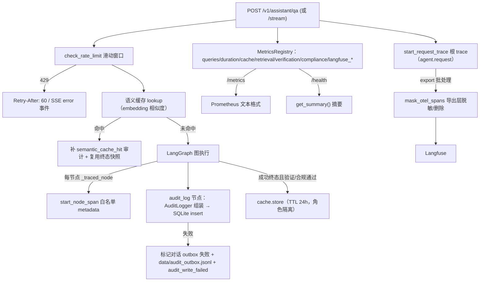

# 观测与运维：审计、指标、追踪、缓存与限流

SecRAG 的运维观测面按**职责边界**分成四块，互不重叠：

1. **SQLite 审计**（`src/utils/audit.py`）：权限、引用、合规与业务留痕的**唯一权威落点**，内容级（问题原文、回答、来源）只在这里；
2. **Prometheus 指标**（`src/utils/metrics.py`）：QPS、延迟、错误率、缓存命中率等**聚合计数**，经 `/metrics` 导出、`/health` 摘要；
3. **Langfuse 追踪**（`src/utils/langfuse_adapter.py`）：Agent/LLM **链路元数据**（节点耗时、token、模型调用、request_id/thread_id），默认只上送白名单标量，内容默认不离开进程；
4. **进程内限流与语义缓存**（`src/utils/rate_limit.py`、`src/utils/semantic_cache.py`）：请求频率控制与答案复用，均为单机轻量实现。

> 一句话记忆：**观测平台看耗时与结构，审计系统看内容**。Langfuse 只接收链路元数据；权限/引用/合规审计仍在本地 SQLite；QPS/延迟/错误率指标仍在 Prometheus（`README.md` 与 `src/config.py` 的模块注释均明确此边界）。

## 1. 总览：观测数据流

## 2. 审计：SQLite 全链路留痕与失败降级

### 2.1 数据模型与写入路径

`AuditLogger.log(state)`（`src/utils/audit.py`）从 `AssistantState` 组装 `AuditEntry`：原始/改写查询、意图、实体、PII 标记、检索计划与来源（去重）、总 chunk 数、过滤后 chunk 数、工具调用、迭代次数、节点耗时与执行路径、验证结果、合规结果、引用、置信度、风险披露与总耗时。`audit_log` 图节点（`src/agents/nodes.py`）委托给该 logger 并调用 `SQLiteAuditStore.insert` 落盘 `data/audit.db`（`audit_entries` 表，`request_id` 主键，按 timestamp/user_role/compliance 建索引），然后把序列化后的 `audit_trail` 写回 state。

**request_id 贯穿三处**：API 入口显式生成后传入初始 state，Langfuse 根 trace 与 SQLite 审计共用同一 id；trace metadata 只含 `request_id`/`thread_id`，不带用户身份。验收测试断言 payload 中不出现 user_id/department/role，且 metadata 键集合不超过白名单。

### 2.2 写失败不阻断回答（P0-5 非阻塞设计）

审计写入失败时回答照常返回，降级路径（`audit_log` 节点）：

1. 若对话 outbox（`audit_outbox` 表，`persist_conversation_turn` 在同一事务里写入的 pending 事件）存在对应 `request_id`，调用 `mark_outbox_failed` 标记失败；
2. 把审计条目追加到本地 `data/audit_outbox.jsonl`（`_write_audit_outbox`，JSONL 记录含 `error`/`entry`/`failed_at`，供后台重试）；
3. 返回带 `audit_write_failed=True` 与 `audit_write_error` 的降级 `audit_trail`。

outbox 本身写失败时只记日志、绝不抛出。`tests/e2e/test_e2e_audit_cache.py::test_tc031_audit_write_failure_does_not_break_qa` 用必失败的审计存储验证：`final_answer` 仍产出、outbox JSONL 出现且包含原条目。

### 2.3 缓存命中补审计

缓存命中跳过整张图（`audit_log` 节点不运行），API 层 `_persist_cache_hit_audit_event` 补写一条持久化审计事件：`execution_path=["semantic_cache_hit"]`、verification/compliance 取命中快照、total_chunks=0；写入失败复用同一 outbox 机制落本地。TC-032 验证命中路径的审计条目与响应体中的快照一致。

## 3. 指标：Prometheus 清单与健康摘要

`MetricsRegistry`（`src/utils/metrics.py`）是进程内、线程安全的内存聚合器，`get_metrics()` 单例。`/metrics` 输出标准 Prometheus 文本格式（`text/plain; version=0.0.4`），`/health` 返回 `get_summary()` 摘要。

| 指标 | 类型/标签 | 含义 |
| --- | --- | --- |
| `secrag_queries_total` | Counter `{role,status}` | 查询总数，status ∈ success/error/timeout/blocked/rate_limited/provider_unavailable |
| `secrag_query_duration_seconds` | Histogram `{role}`（桶 0.1–60s） | 查询延迟，支持 P50/P95/P99 |
| `secrag_cache_hits_total` / `secrag_cache_misses_total` | Counter | 语义缓存命中/未命中（由 `record_query(cached=...)` 维护） |
| `secrag_retrieval_chunks_total` | Counter `{source}` | 检索返回 chunk 总数 |
| `secrag_verification_passed_total` / `secrag_verification_failed_total` | Counter | 验证通过/失败数 |
| `secrag_compliance_blocked_total` | Counter | 合规拦截数 |
| `secrag_active_requests` | Gauge | 当前活跃请求数（QA 入口 inc，收尾 dec） |
| `secrag_langfuse_dropped_total` | Counter `{reason}` | Langfuse adapter 丢弃的 trace/span（如 `sampled_out`） |
| `secrag_langfuse_export_errors_total` | Counter `{reason}` | Langfuse 客户端/导出失败（timeout/auth/exception） |

`get_summary()` 返回 `uptime_seconds`、`total_queries`、`success_queries`、`success_rate`、`active_requests`、`cache_hits/misses`、`cache_hit_rate`、`latency_p50/p95/p99_seconds`、`verification_passed/failed`、`compliance_blocked`。`/health` 还检查 ChromaDB 连通性与文档计数：`chroma.status` 为 `"error"` 时整体仍返回 200，避免负载均衡器摘除节点。`tests/test_api_routes.py` 验证 `/health`、`/metrics` 在真实 ASGI 栈可达，且 SPA 通配路由不会截走它们。

## 4. Langfuse 追踪：两层脱敏防线 + fail-open

### 4.1 职责与启用条件

`LangfuseAdapter` 是 Agent/LLM 链路观测的唯一入口（`src/utils/langfuse_adapter.py`），通过 `get_langfuse()` 取单例。启用条件：`LANGFUSE_ENABLED=true` 且 public/secret key 齐全且 `LANGFUSE_HOST` 通过 `is_valid_langfuse_host`（仅接受 http/https 绝对地址；刻意放行 localhost/内网以支持自托管）。未启用时整体 no-op——所有方法安全可调、业务零感知。`LANGFUSE_ENABLED=true` 但缺 key 时 `Settings` 校验直接启动报错（`src/config.py`）。

配置（`.env` / 环境变量）：`LANGFUSE_HOST`（默认 `https://cloud.langfuse.com`）、`LANGFUSE_PUBLIC_KEY`、`LANGFUSE_SECRET_KEY`、`LANGFUSE_SAMPLE_RATE`（0.0–1.0，默认 1.0）、`LANGFUSE_CAPTURE_CONTENT`（默认 false）。docker-compose 显式透传这些变量便于按环境覆盖。

### 4.2 第一层防线：metadata 白名单

`LangfuseTraceMetadata` 是固定的标量 TypedDict 白名单（`request_id`、`thread_id`、`node_name`、`model_name`、`duration_ms`、`prompt_tokens`、`completion_tokens`、`total_tokens`、`retry_count`、`retrieval_count`、`cache_hit`、`verification_status`、`compliance_status`、`status`、`error_type`）。`filter_metadata` 是 metadata 的唯一入口：未登记键、嵌套 dict/list、对象、None 一律丢弃——新增字段必须改本文件白名单，无法绕过。`tests/test_langfuse_acceptance.py::test_metadata_whitelist_blocks_all_canary_payloads` 用金丝雀标记（原始问题/回答/chunk/SQL/客户 ID/持仓/手机/邮箱）验证只有白名单内字段幸存。

### 4.3 第二层防线：导出层兜底删除/脱敏

锁定版 langfuse 4.15.6 的 langchain `CallbackHandler` 会把每次 chain/LLM/tool run 的 input/output 原文挂到 span 属性上，且该 handler 不提供 mask 选项；SDK client 的 mask 只作用于 SDK API 写入的数据。因此 `_mask_otel_spans`（`mask_otel_spans` 回调）在 **export 阶段**兜底：

- 默认：删除全部内容属性（`langfuse.trace.input/output`、`langfuse.observation.input/output`、`langfuse.observation.status_message`、`gen_ai.*` 消息/工具键与 `gen_ai.prompt./completion./request.` 前缀）；
- `LANGFUSE_CAPTURE_CONTENT=true` **且** `APP_ENV=development` 时才保留，且每条字符串先经 `redact_pii` 统一脱敏（`_sanitize_text`）；其他环境强制关闭并告警；
- **fail-closed**：属性不可读时抛异常，由 SDK 丢弃整个导出批次——宁可丢数据，不放行未脱敏原文（export 是异步批处理，不影响业务路径）。

另一条内容泄漏路径是 SDK 媒体预上传：导出管线先做媒体预上传、后执行 mask，base64 data-URI 会先离开进程。adapter 在构造 client 前无条件设置 `LANGFUSE_MEDIA_UPLOAD_ENABLED=false`（`_disable_langfuse_media_upload`）关闭媒体上传。验收测试验证：金丝雀进入过系统 prompt/输出，但不出现在任何上送 payload 中；工具 span 只带 `{"node_name": "calculator"}`。

### 4.4 采样语义

`LANGFUSE_SAMPLE_RATE` 在 adapter 请求边界做头部采样（SDK 采样固定 1.0，采样决策集中在 adapter）。规则：

- 建档时已知错误（`is_error=True`）不参与采样，一律保留；
- 采样掉的请求若执行中失败，`finish(status="error")` 补建一条仅含白名单 metadata 的错误 trace（`agent.request.error`），保证每个错误请求都有 trace；
- 被采样掉的正常请求计 `secrag_langfuse_dropped_total{reason="sampled_out"}`，不算失败、不告警。

### 4.5 fail-open 语义

未配置/初始化失败/超时/鉴权失败/写入异常时，业务链路照常完成；错误只写本地日志（`secrag.langfuse` logger 的 warning，含异常类型与原因）并累计 `secrag_langfuse_export_errors_total`（按 timeout/auth/exception 尽力分类），绝不抛进业务路径。export 阶段（OTLP 批处理线程内部消化错误）的失败由 `_OtelExportFailureLogHandler` 日志钩子转入同一本地告警与计数——该钩子挂在 `opentelemetry.exporter.otlp.proto.http.trace_exporter` logger 上，覆盖"Langfuse 服务不可用"的主要场景。验收测试逐条覆盖：业务 500 保持 500（根 trace 收尾为 error）、Langfuse 全程不可用时各路径全部 fail-open 并计数、span update 中途失败被吞掉并记日志。

### 4.6 传播机制与 span 形态

API 入口 `start_request_trace` 建根 trace（`agent.request`），`set_current_trace` 挂到 contextvar，请求 finally 里 `reset_current_trace` + `trace.finish`。节点侧 `start_node_span` 取当前 trace 建 span；`_traced_node` 包装器给每个外层图节点建 span（`_node_span_metadata` 只放标量：检索数、重试数、验证/合规状态、模型名），ReAct 子图内 `call_reason_model` 手动建 `call_reason_model` span（含 token 用量与尝试序号），工具 span 在 `authorize_reason_tool_call`（图线程内）创建——权限校验失败的调用不产生工具 span。回调经 `RunnableConfig.callbacks` 传入 LangGraph，覆盖节点内 LLM 调用与工具调用；传播依赖 Python 上下文语义（`asyncio.to_thread` 与 LangGraph astream 复制 context），工具线程池 `executor.submit` 不复制 context 但工具 span 在创建侧不受影响。未采样/未启用时 handler 为 None，业务零感知。

## 5. 语义缓存：默认启用、六维绑定、只缓存成功终态

`SemanticCache`（`src/utils/semantic_cache.py`）基于 embedding 余弦相似度（阈值 0.90）复用历史答案。运维语义：

- **默认启用（ISSUE-26）**：`semantic_cache_enabled` 默认 `True`——启用条件已全部落地：缓存绑定身份与授权范围、客户上下文、规范化问题、上下文摘要哈希与知识库版本；只缓存验证与合规均通过的成功终态；命中路径仍写审计并保存会话回合；
- **六维绑定**：`CacheBinding` 六个维度（`role`、`user_id`、`client_id`、`permission_scope` 授权范围指纹、`normalized_query` 规范化问题、`context_hash` 上下文摘要哈希、`kb_version` 知识库版本指纹）在 SQL 层全部等值匹配后才进入 embedding 相似度比较——跨用户/跨客户/跨权限集/跨知识库版本都不会复用。`kb_version` 取自 `document_registry` 的文档数 + 最近入库时间哈希：入库成功必然改变指纹，缓存条目随之自然失效，不依赖进程内通知（入库 CLI 与 API 是两个进程）；注册表缺失时指纹为空串，行为退化为未绑定版本；
- **角色隔离**：绑定维度中的 role/user_id/client_id/permission_scope 使跨角色不得命中（TC-033）；
- **只缓存成功终态**：API 层仅在 `answer` 非空且长度 > 10、`compliance.passed` 与 `verification.passed` 均为 True 时 `cache.store`（TC-034：合规未通过/答案过短不入缓存）；store 时把 compliance/verification 终态快照随条目落库，命中时原样返回（不再硬编码 `passed=True`，旧库自动补列）；
- **TTL 24h**（`DEFAULT_CACHE_TTL_SECONDS=86400`），过期条目 lookup 不命中，`clear_expired` 可清理（TC-035）；
- **命中补审计与会话回合**：命中路径补 `semantic_cache_hit` 持久化审计（`execution_path=["semantic_cache_hit"]`，verification/compliance 取命中快照）并调用 `_persist_cache_hit_turn` 保存会话回合，失败复用 outbox；命中相似度/hit_count 等内部字段只进审计与指标，**不进响应体**——命中与普通路径返回同一 `AssistantQAResponse` 字段集（TC-032 断言 `"cached"`、`"cache_similarity"` 不在响应体）；
- 存储用 SQLite WAL 模式 + 线程本地连接；命中率按真实 lookup 请求口径统计（`lookup_hits / lookup_total`），禁用态与空查询的短路不计数（`tests/test_semantic_cache.py`）；
- **admin 缓存统计/清理端点**：`GET /v1/admin/cache/stats`（admin/technical）返回 `get_stats()`（条目数、命中率、阈值、TTL、enabled）；`POST /v1/admin/cache/clear`（admin/technical）按 `clear_expired_only` 清理过期或全清（`clear_all` 同时归零命中计数）。

缓存查询涉及 embedding 计算与全表扫描，QA 入口经 `asyncio.to_thread` 放到线程池执行，避免阻塞事件循环。

## 6. 限流：进程内滑动窗口

`check_rate_limit`（`src/utils/rate_limit.py`）是进程内、加锁的滑动窗口：默认每分钟 30 次、窗口 60 秒，按 `key -> deque[timestamp]` 记录，过期记录在检查时弹出；超限返回 `(False, 0)`。key 由 `get_rate_limit_key` 生成：**优先 `user_id`**，回退 `client_ip`，再回退 `"anonymous"`。

- 非流式 QA：超限返回 HTTP 429，带 `Retry-After: 60` 头，指标记 `rate_limited`（`tests/test_api_routes.py::test_qa_endpoint_rate_limit_returns_429` 断言头）；
- 流式 QA：超限返回 **SSE `error` 事件**（`event: error` + `{"type":"error","detail":"请求过于频繁"}`），HTTP 状态仍为 429；
- 限流窗口与计数在**进程内存**中，多 worker/多实例各自独立——模块注释明确：生产环境应替换为 Redis 分布式限流，此为单节点部署的轻量实现。

## 7. SQLite 健壮性与启动预热

- **统一连接入口（ISSUE-18）**：所有 SQLite 存储（审计、会话、语义缓存、入库注册表、持仓/扫描）经 `src/utils/sqlite_support.py` 的 `connect_sqlite` 打开——统一 `journal_mode=WAL` 与 `busy_timeout`，写写不再互斥阻塞；各 store 的 DDL 应用按库路径做进程级去重（`_schema_applied_paths`），避免每操作重放 DDL；
- **同步 IO 移出事件循环（ISSUE-18）**：API 层的同步 SQLite 调用（`ensure_thread_for_qa`、缓存 lookup/store、图执行）经 `asyncio.to_thread` 放到线程池，事件循环不再被磁盘 IO 阻塞；
- **启动预热（ISSUE-16）**：服务启动时在后台线程依次预热图编译、向量引擎（Chroma 连接 + embedding 模型）、BM25 全量索引（jieba 分词 10-30s 不再落在首个请求上），逐步记录耗时日志（`secrag.warmup`）；单步失败只告警不阻断启动（`tests/test_startup_warmup.py`）。

## 8. 部署形态与运维入口

### 8.1 docker-compose 单容器

`docker-compose.yml` 定义单服务 `secrag`：

- `secrag_data` volume 挂载 `/data`，持久化 ChromaDB（`/data/chroma`）、SQLite 审计/会话库（`/data/audit.db`、`/data/conversations.db`）与 HuggingFace 模型缓存（`HF_HOME`/`TRANSFORMERS_CACHE=/data/hf_cache`，首次启动下载 bge-small-zh-v1.5 ~100MB，后续免下载）；
- 容器内环境变量覆盖 `.env` 中的路径；Langfuse 观测配置显式透传（`LANGFUSE_ENABLED`/`HOST`/`PUBLIC_KEY`/`SECRET_KEY`/`SAMPLE_RATE`/`CAPTURE_CONTENT`，默认关闭）；
- `healthcheck`：`curl -f http://localhost:8000/health`，30s 间隔、90s 启动宽限、3 次重试；`restart: unless-stopped`；
- 端口 `${APP_PORT:-8000}:8000`。

`start.sh` 是本地/裸机启动入口：默认 `127.0.0.1:8001`（可用 `HOST`/`PORT` 覆盖），日志 tee 到 `/tmp/secrag-<port>.log`，端口被占时默认 kill 现有进程（`KILL_EXISTING=0` 可关闭），`BUILD_FRONTEND=auto|always|never` 控制 React 前端构建，最终 `uv run uvicorn src.api.main:app`。Dockerfile 侧由 uvicorn 直接启动。

### 8.2 已知边界（单机形态）

- **内存 checkpointer**：`build_agent_with_checkpoint` 用 `InMemorySaver`（`src/agents/graph.py`），服务重启后不恢复图执行状态；会话内容已由 SQLite 持久化，但图级中断不恢复；
- **单机 SQLite 与单进程后台入库**：会话、审计、语义缓存均本地 SQLite；入库后台任务（`create_ingestion_run` 的 `BackgroundTasks`）基于单机进程，**不支持多实例任务调度**；
- **限流为进程内**（见第 6 节）；语义缓存已默认启用，但命中依赖六维绑定，跨进程入库后由知识库版本指纹自然失效（见第 5 节）。

## 9. 聚焦测试

| 测试 | 覆盖 |
| --- | --- |
| `tests/e2e/test_e2e_audit_cache.py` | TC-030 审计留痕完整性（execution_path 全节点、来源、验证/合规、置信度）；TC-031 审计写失败不阻断 + outbox + `audit_write_failed`；TC-032 命中返回存储快照、跳过 Agent、不泄露内部字段、补审计；TC-033 角色隔离；TC-034 失败终态不入缓存；TC-035 TTL 过期与清理 |
| `tests/test_langfuse_acceptance.py` | 隐私红线：metadata 白名单挡全部金丝雀、mask 删除内容属性、capture_content 开发态脱敏；fail-open：超时/鉴权/写入异常业务不变且计数按 reason；request_id 关联且不暴露身份；不可用全路径计数与告警；采样丢弃计 dropped 不告警 |
| `tests/e2e/test_e2e_langfuse_acceptance.py` | 全链路金丝雀 payload 卫生（问题/chunk/回答/工具参数/SQL/客户 ID 均不进 payload）、callback 传播到 LLM 与工具、节点/工具 span 挂根 trace、关闭与采样掉时业务结果与基线一致 |
| `tests/test_langfuse_adapter.py` | adapter 级：no-op、白名单、脱敏、fail-open、采样、host 校验、callback 绑定 |
| `tests/test_langfuse_wiring.py` | 节点 span metadata（模型名/token/检索数/重试数）、工具 span 零内容、未授权工具无 span、无 adapter 时 no-op |
| `tests/test_semantic_cache.py` | 终态快照持久化与旧库补列、命中率按真实 lookup 口径、禁用态不计数、clear_all 归零 |
| `tests/test_api_routes.py` | `/health`、`/metrics` 可达且不被 SPA 通配截走；429 带 `Retry-After: 60`；504 超时 |
