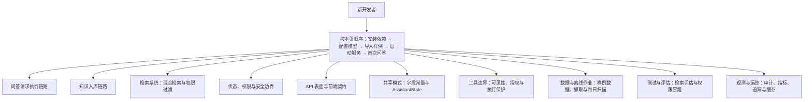

# 快速开始：从启动服务到第一次问答

SecRAG 是一个机构投研场景的 Agentic RAG 原型。你可以先把它理解成三件事：

1. 把资料切成 chunk，向量化后放入 ChromaDB；
2. 收到问题后按角色检索证据，让 Agent 推理和调用工具；
3. 对答案做引用、数字、合规检查，再保存会话和审计记录。

> ⚠️ 这是架构验证原型，不是生产系统。样例数据、固定 demo token 和内置评估集只能证明流程，不能证明生产安全性、吞吐量或回答质量。

## 任务路由图

本页是整个 wiki 的导航枢纽。完成快速开始后，按你想解决的问题进入对应页面：



任务路由图：完成快速开始后，按你想解决的问题进入对应 wiki 页面。

## 1. 安装依赖

项目要求 Python 3.11+，使用 `uv` 管理环境：

```bash
uv sync --all-extras
```

这条命令会根据 `pyproject.toml` 和 `uv.lock` 创建或同步虚拟环境，并安装运行与测试依赖（`--all-extras` 会带上 dev 组的 pytest、pytest-asyncio 与 ruff）。裸跑 `uv sync` 会卸载未写入 `pyproject.toml` 的包，所以开发依赖请始终用 `--all-extras` 或 `--extra dev`。

## 2. 创建配置文件

```bash
cp .env.example .env
```

### 选择 OpenAI-compatible 服务

默认配置是 OpenAI 兼容接口（`.env.example` 默认指向火山方舟 Ark，`OPENAI_MODEL=deepseek-v4-flash`）。把 `.env` 中的值换成你实际使用的服务：

```dotenv
LLM_PROVIDER=openai
OPENAI_API_BASE=https://your-provider.example/v1
OPENAI_MODEL=your-model
OPENAI_API_KEY=your-key
```

`LLM_PROVIDER=openai` 时 `Settings` 校验会在启动阶段直接报错（`OPENAI_API_KEY 未设置`），而不是等第一次请求失败。密钥不要提交到 Git。

### 选择本地 Ollama

如果本机已经运行 Ollama，可以改成：

```dotenv
LLM_PROVIDER=ollama
OLLAMA_BASE_URL=http://localhost:11434
LLM_MODEL=llama3.1:8b
```

两种模式都使用 `EMBEDDING_MODEL` 做文档和问题的向量化，默认是 `BAAI/bge-small-zh-v1.5`。第一次运行可能需要下载模型。**入库和检索必须保持同一个 embedding 模型**：Chroma collection 的 metadata 记录着入库时的模型名，检索器初始化时发现与当前配置不一致会抛 `RuntimeError` 阻止使用——切换模型必须全量重新入库，不能只改 `.env`。

`LANGFUSE_ENABLED=true` 时 `LANGFUSE_HOST`、`LANGFUSE_PUBLIC_KEY`、`LANGFUSE_SECRET_KEY` 必填，缺失同样在启动时校验报错。

## 3. 导入最小样例知识库

先把示例资料写入向量库：

```bash
uv run python scripts/ingest.py data/raw/demo_knowledge_base/samples/product product
uv run python scripts/ingest.py data/raw/demo_knowledge_base/samples/regulation regulation
uv run python scripts/ingest.py data/raw/demo_knowledge_base/samples/faq faq
uv run python scripts/ingest.py data/raw/demo_knowledge_base/samples/report research_report
```

预检要求**每个源文件旁边都有一个同名 `.meta.json` 权限清单**（含 `doc_type`、`retrieval_source`、`permission_level`、`allowed_roles` 等字段），缺失清单、doc_type 非法或不属于所选分类的文件会进入预检失败清单而不会入库。样例目录已自带这些清单，例如 `product/sample_wealth_product_risk_disclosure.html.meta.json`。

入库过程会解析文件、分块、生成 embedding，并将 chunk 的来源、版本和权限元数据写入 ChromaDB。重复执行时，未变化文件会被跳过；需要完整扫描并归档已删除文档时再加 `--full-scan`。

更详细的入库说明见：[知识入库链路](tutorials/knowledge-ingestion.md)。

## 4. 启动服务

```bash
uv run uvicorn src.api.main:app --host 127.0.0.1 --port 8000
```

启动后可以打开：

| 地址或接口 | 用途 |
| --- | --- |
| `http://127.0.0.1:8000/` | 前端 UI：存在 `frontend/dist` 构建产物时服务 React SPA，否则回退旧版 HTML UI（`/legacy` 始终可访问旧 UI） |
| `http://127.0.0.1:8000/admin` | 知识库管理后台（admin 角色） |
| `http://127.0.0.1:8000/docs` | FastAPI 自动生成的 Swagger UI |
| `POST /v1/assistant/qa` | 问答接口（普通 JSON） |
| `POST /v1/assistant/qa/stream` | 问答接口（SSE 流式，逐节点进度 + 终态 answer 事件） |
| `/v1/assistant/threads*` | 会话创建、查询和删除 |
| `/v1/admin/ingestion/*` | technical 角色的入库管理 |
| `/v1/admin/documents*` | admin/technical 的知识库列表、统计、chunk 详情、搜索与删除 |
| `/health` | 健康检查（存活状态 + ChromaDB 文档数 + 指标摘要） |
| `/metrics` | Prometheus 文本格式指标，供抓取与 Grafana |

也可以跳过本地环境，用 docker compose 一键启动：

```bash
cp .env.example .env   # 先填入 OPENAI_API_KEY
docker compose up -d
```

容器从 `.env` 读取配置，并把 ChromaDB、SQLite 与 HF 模型缓存统一落到 `secrag_data` volume 持久化；healthcheck 每 30 秒探测一次 `/health`。开发期还有一个 `./start.sh` 便捷脚本（可选构建 React 前端、默认端口 8001、自动清理占用端口的旧进程）。

## 5. 发送第一条问答请求

仓库内置 demo token，服务端会根据 token 绑定角色：

| Token | 角色 |
| --- | --- |
| `demo-advisor` | advisor |
| `demo-sales` | institutional_sales |
| `demo-compliance` | compliance |
| `demo-ops` | operations |
| `demo-tech` | technical |

示例：

```bash
curl -X POST http://127.0.0.1:8000/v1/assistant/qa \
  -H 'Content-Type: application/json' \
  -H 'Authorization: Bearer demo-tech' \
  -d '{"query":"系统操作流程怎么查？"}'
```

问答、会话和入库接口都要求 `Authorization: Bearer <token>`，未知 token 返回 401。同一 `user_id` 的问答请求受每分钟 30 次的滑动窗口限流，超限返回 429 并带 `Retry-After: 60`。请求体里不能携带身份或角色字段——服务端只相信 token 绑定，不信任请求体身份。

响应中最值得先看的字段是：

- `answer`：最终回答；
- `citations`：答案引用的证据；
- `confidence`：综合置信度；
- `compliance`：合规检查结果；
- `thread_id` / `turn_id`：会话和轮次标识。

完整审计链路不会通过这个接口返回，而是由服务端写入 SQLite。答案语义缓存默认关闭；开启后也只缓存验证与合规均通过的成功终态，且按角色隔离。

## 6. 运行两个内置演示场景

保持服务运行，再开一个终端：

```bash
uv run python scripts/demo.py
```

脚本会调用当前环境配置的真实 LLM，演示一个允许查询和一个因角色权限受限的查询，并检查回答、引用、置信度和合规字段；任一断言失败会以非零码退出。完整审计只在服务端持久化，不通过问答接口返回。

固定 demo token 只适合本地演示，不能替代生产环境的 IdP、签名 token 和授权策略。

## 7. 下一步按什么顺序读代码

按任务路由图对应，建议顺序：

1. 先读 [问答请求执行链路](tutorials/request-execution.md)，跟着 `POST /v1/assistant/qa` 走一遍：认证、限流、会话、LangGraph 外层图与 ReAct 子图、验证重推、合规阻断与缓存命中分支；
2. 再读 [知识入库链路](tutorials/knowledge-ingestion.md)，理解证据如何变成带权限元数据的 chunk 进入 ChromaDB；
3. 然后读 [检索系统](architecture/retrieval-system.md)，理解 Planner 检索计划、向量 + BM25/RRF 混合检索与结果级权限过滤；
4. 接着读 [状态、权限与安全边界](architecture/state-and-safety.md)，理解认证、检索权限、工具授权、验证与合规每一层为什么各查一遍；
5. 需要对接前端或查接口契约时读 [API 表面与前端契约](architecture/api-surface.md)（普通问答、SSE 流式、会话、入库管理、知识库管理、健康检查与指标端点及 React 消费契约）；
6. 查字段名、枚举值与 `AssistantState` 定义时读 [共享模式](concepts/schemas-and-state.md)，那里是全项目字段常量的唯一权威；
7. 想搞清 ReAct 工具子系统时读 [工具边界](architecture/tool-boundaries.md)，理解工具注册表、`get_tools_for_role` 的可见性规则（非检索工具必须显式列入白名单）与 `authorize_reason_tool_call` 的四重执行边界检查；
8. 需要理解样例数据、真实证券数据抓取与每日扫描分级时读 [数据与离线作业](operations/data-and-jobs.md)；
9. 想跑检索评估或权限冒烟检查时读 [测试与评估](testing/evaluation.md)，了解 `scripts/evaluate_retrieval.py` 与 `scripts/check_permissions.py` 的用法和内置评估集的局限；
10. 部署与排障时读 [观测与运维](operations/observability.md)，了解 SQLite 审计、Prometheus 指标、Langfuse 追踪的隐私红线与 fail-open 语义、缓存与限流。

开发验证命令：

```bash
uv run ruff check .
uv run pytest
```

这个项目是架构验证原型，不是生产系统；样例数据和固定 token 仅用于本地学习与测试。当前已知边界包括：内存 checkpointer（服务重启不恢复图执行状态）、单机 SQLite 与单进程后台入库（不支持多实例）、事件分级阈值未经真实标注数据标定。
