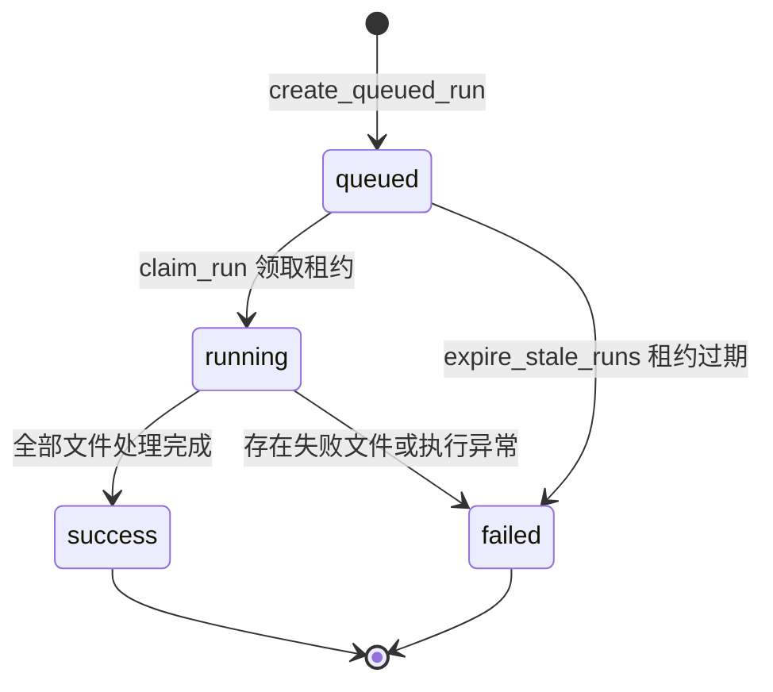
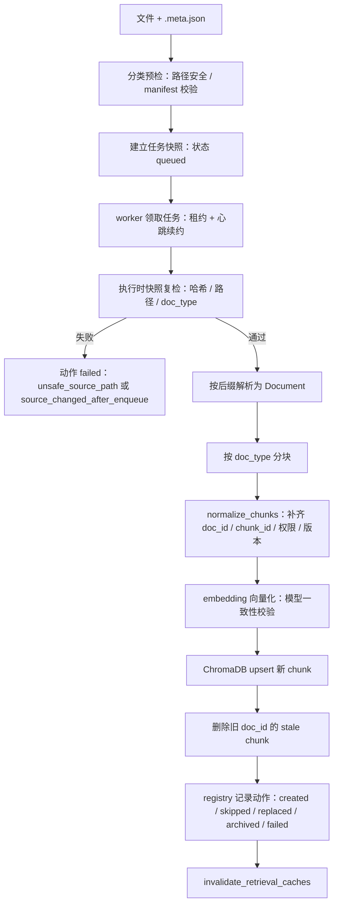

# 知识入库链路：文件如何变成可检索证据

“入库”就是把文件加工成带元数据的文本 chunk 和向量，保存到 ChromaDB；“检索”则是在问答时把问题也变成向量，找回最相关的 chunk。两者必须使用同一套身份、权限元数据和 embedding 模型，问答才有可靠证据。

## 1. 从 CLI 或 API 创建任务

最简单的 CLI 入口是：

```bash
uv run python scripts/ingest.py data/raw/demo_knowledge_base/announcements announcement
```

`scripts/ingest.py` 只解析参数（目录、doc_type、`--full-scan`），随后调用 `pipeline.ingest_directory`，真正的工作由 `src/ingestion/service.py` 的 `IngestionService` 完成。API 管理路由也依赖同一个 `IngestionService`，所以 CLI 和 HTTP 不会各自维护一套入库规则。

服务先做分类预检（`preflight_category`）：

- 路径安全：`ensure_safe_source_path` 禁止任何路径分量出现符号链接，分类目录必须位于 `data/raw` 之内，每个文件必须位于分类目录之内；
- 文件格式受支持（`SUPPORTED_SUFFIXES`：pdf / docx / doc / html / htm / csv / xlsx / xls）；
- 每个文件都有同名的 `<文件名>.meta.json` 权限清单，且清单内容合法、`doc_type` 属于所选分类。

预检通过后，服务把文件相对路径、文件哈希、manifest 哈希、文档类型和顺序写入 SQLite `ingest_runs` / `ingest_run_files`，状态先是 `queued`。创建任务在 `BEGIN IMMEDIATE` 事务中完成：同一时间只允许一个活动任务（`queued` 或 `running`），已有活动任务时抛出 `ActiveIngestRunError`，API 层把它映射为 409。

入库管理 API 只对 `technical` 角色开放；创建任务接口返回 202，并通过后台任务执行 `execute_run`。

## 2. 任务状态机与 worker 租约



图：入库任务状态机——queued 排队、running 执行中、success/failed 终态，过期租约统一回收为 failed。

执行由单个 worker 进程完成：

- `claim_run` 只在任务仍为 `queued` 且租约未过期时把状态改为 `running`，并写入 `worker_id` 与 `lease_expires_at`；
- 后台心跳线程每 `INGEST_WORKER_HEARTBEAT_SECONDS`（15 秒）续约一次，把租约延长到 `INGEST_WORKER_LEASE_SECONDS`（120 秒）；
- 每个文件处理前后都会调用 `owns_run` 校验租约仍属于当前 worker；心跳或归属校验失败抛出 `IngestWorkerLeaseLostError`，worker 立即停止处理，防止两个进程同时处理同一任务；
- 查询或创建任务时 `expire_stale_runs` 会把租约已过期的 `queued`/`running` 任务标记为 `failed`（错误码 `worker_lease_expired`），之后新任务才能创建。

`tests/test_ingestion_service.py` 验证了：租约过期后旧任务被回收、新任务可以创建；embedding 模型初始化失败会让整个任务异步失败（错误码 `embedding_unavailable`）。

## 3. 执行时快照校验

排队和真正执行可能不是同一时刻。执行时 `_validate_snapshot` 会对每个文件重新检查：

- 文件与 manifest 路径仍然安全；
- 文件哈希等于快照中的 `file_hash`；
- manifest 哈希等于快照中的 `metadata_hash`；
- manifest 中的 `doc_type` 等于快照中的 `doc_type`。

任何一项不满足都不会调用真正的处理函数，而是为该文件记录一条 `failed` 动作：

- 路径不安全 → 错误码 `unsafe_source_path`；
- 文件或 manifest 在排队后被删除/修改 → 错误码 `source_changed_after_enqueue`。

只要存在失败文件，任务终态就是 `failed`，`error_code` 取第一个失败文件的错误码。`test_execute_run_processes_only_snapshot` 验证排队后新增的文件不会混入本轮处理；`test_source_change_after_enqueue_fails_without_processing` 验证排队后修改文件会让任务失败且不调用处理函数。

## 4. 文件先解析，元素先聚合去噪，再按文档类型分块

`load_documents` 按后缀选择 PDF（UnstructuredLoader，解析失败返回空列表，随后 pipeline 以“解析结果为空”把该文件标记为 failed）、Word、HTML、CSV 或 Excel loader，把文件统一转换成 LangChain `Document`。

**解析元素先聚合（CHUNKER v2，ISSUE-21）**：UnstructuredLoader 按“一个元素一个 Document”返回，碎片元素直接送切分器时短元素原样通过、`chunk_size` 永不生效、元素之间也从不合并。`chunk_documents` 对带解析元素标记的文档先执行 `aggregate_document_elements`：

- **版面噪声过滤**：`Header`、`Footer`、`EmailAddress` 三类元素直接丢弃（现网曾把 450+414+2 条噪声写进索引）；
- **相邻同类文本元素聚合**到设计块大小后再切分，`chunk_size` 真正生效；聚合块记录页码区间（`page_spans`），切出的 chunk 回填正确页码；
- **表格元素整体保留**：`Table` 块不与正文合并，超长表格按 `<tr>` 行切分并把表头/单位行回填到每一片，表头与其描述的数据行不分离；
- **重复版面去重**：同一文档内指纹相同且 ≥40 字符的 chunk（如跨页重复的表注）只保留首个。

无解析元素标记的文档（CSV/Excel 等纯文本）仍走原路径：按 `doc_type` 选择 `RecursiveCharacterTextSplitter`：

- 研报和法规：约 500 字、重叠 100 字；
- 公告：约 300 字、重叠 50 字；
- 财务数据：约 800 字、重叠 200 字；
- 会议纪要：约 400 字、重叠 80 字。

重叠区的作用是避免一句话刚好被切在两个 chunk 的边界，导致单独检索时上下文不完整。当前语料（2026-09 演练）已按 CHUNKER v2 重建，约 3,566 个 chunk；chunk_id 与旧版分块不兼容，重新入库后评估集必须重跑生成器。

注意：`ingest_document` 以 manifest 中的 `doc_type` 为有效文档类型（`effective_doc_type = sample_metadata.get("doc_type", doc_type)`），CLI/API 传入的 doc_type 只是缺省值；分块策略和 `retrieval_source` 映射都基于这个有效值。

## 5. 每个 chunk 都会补齐稳定身份和权限元数据

`derive_doc_id` 优先使用 manifest 中的 `doc_id`；没有时再按 URL（巨潮公告、东方财富研报有专门 ID 格式）、数据集内容（财务 CSV/Excel 按 provider + API + 股票/日期）或相对路径生成稳定 ID。

`normalize_chunks` 为每个 chunk 写入：

- `doc_id`、`chunk_id`、`chunk_index`、`doc_version` 和 `ingested_at`；
- 文件、manifest、解析和 chunk 内容的哈希；
- `source`、标题、日期、股票代码等检索字段；
- `permission_level`、`allowed_roles` 和 `retrieval_source`；
- parser/chunker/embedding 模型版本。

其中 `chunk_id = build_chunk_id(doc_id, index, content)`（sha1 前 24 位），内容变了 ID 通常就变，这正是“替换时能找出哪些旧 chunk 该删”的依据。日期可解析时还会写入数值 `date_day` 字段供 Chroma 范围过滤；日期缺失或不可解析时不写该字段，查询端也就不会生成对应过滤器。

manifest 不是可选备注：`load_sample_metadata` 会校验权限等级、角色列表和 `doc_type` 与检索源的对应关系；非公开文档没有 `allowed_roles` 会在入库前就失败。

## 6. Embedding 和 ChromaDB 写入

`get_embedding_model` 优先从本地 HuggingFace 缓存加载配置的模型（`local_files_only=True`），缓存没有才尝试在线下载；模型实例按 `(model_name, 设备/参数)` 做**进程级缓存**（ISSUE-15），同一进程内重复入库不再重复加载模型。`upsert_chunks` 使用稳定的 chunk ID 按 `CHROMA_UPSERT_BATCH_SIZE`（5000）分批 `add_documents`，并在 collection metadata 里记录 embedding 模型名。

入库侧（`get_vectorstore` / `upsert_chunks`）与检索侧（`ChromaVectorRetriever`）都会校验 collection 记录的模型与当前配置一致：

- 未记录模型（legacy 数据）：补写当前模型名并告警，不阻断；
- 记录模型与配置不一致：抛 `RuntimeError` 阻止继续，因为不同模型产生的向量不在同一个空间，检索分数没有意义。切换 embedding 模型必须重新入库。

## 7. 增量更新、跳过、替换与归档

入库 registry（`document_registry` 表，以 `doc_id` 为主键）保存文件哈希、manifest 哈希、解析哈希、解析器/分块器版本、embedding 模型、chunk 数和文档版本。只有这些信息与 registry 完全一致且文档状态为 `active`，`_should_skip` 才把文件标记为 `skipped`（只更新 `last_seen_at`），避免重复解析和向量化。

如果内容或版本发生变化，任务走 `replaced`：

1. `doc_version` 递增（新文档从 1 开始），重新解析、分块并补齐元数据；
2. 先按稳定 chunk ID upsert 新 chunk；
3. 找出该 `doc_id` 旧有但新版本不再存在的 chunk ID；
4. 删除这些 stale chunk；
5. 在 registry 中写入新哈希、版本和 chunk 数（`upsert_success`）。

`--full-scan` 还会把 registry 中 `active`、位于任务目录内但本次未出现的文档标记为 `archived`，并删除它们的全部 chunk；普通增量扫描不会因为目录里少了一个文件就自动归档。处理异常的文件动作记为 `failed`（错误码 `document_processing_failed`）。

任务结束后，无论成功还是部分失败，`execute_run` 都会调用 `invalidate_retrieval_caches()`：同时清空进程内检索计划 TTL 缓存和 BM25 索引缓存，保证知识库变更后检索不再返回旧结果。

## 8. 问答时如何把 chunk 找回来

问答链路中的 `HybridRetriever` 先按用户角色过滤 Planner 的检索计划（越权 source 转为显式拒绝结果），再对每个允许的 source 执行领域检索。product / regulation / report / FAQ 领域检索器共享同一个 `ChromaVectorRetriever` 实例：

1. 用同一个 embedding 模型把查询转成向量，在 ChromaDB 中按 query 和 filters 找候选 chunk；
2. 按 `top_k × PERMISSION_OVERFETCH_FACTOR`（3 倍）超量取回候选，避免高分候选全部越权时误判“全部越权”；
3. 如果 BM25 索引可用，按 `retrieval_source` 精确过滤后做关键词检索，再与向量结果做 RRF 融合；
4. BM25 构建或查询失败时静默降级为纯向量结果；
5. 最后按 `permission_level` 与 `allowed_roles` 对结果 metadata 做结果级过滤，过滤后再截断到请求的 `top_k`；越权结果替换为权限拒绝占位结果。

ChromaDB 返回的 distance 会在 `ChromaVectorRetriever._format` 中转换成统一的 `score = 1 - distance`（cosine 距离转相似度），上游节点因此只需要处理项目自己的 `RetrievalResult` 格式。

## 9. 一张图记住整条链路



图：文件从预检、快照、解析分块、元数据补齐、embedding、ChromaDB 写入到 registry 状态机的完整入库链路。

读这条链路时，最容易忽略的三个不变量是：入库与检索必须使用同一 embedding 模型；chunk 必须带可追踪的稳定 ID 和版本信息；权限元数据必须在检索结果进入 LLM 前完成过滤。
