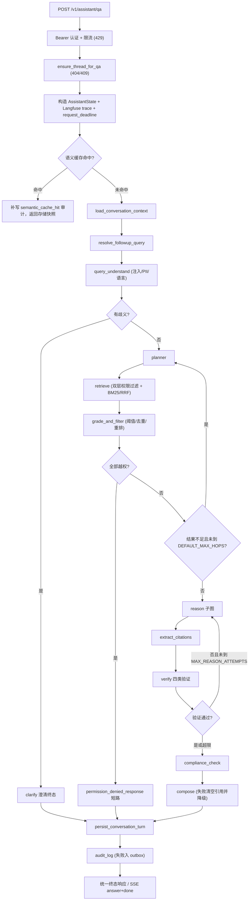

# 问答请求执行链路：从 HTTP 到最终答案

可以把一次问答想成一条“传送带”：API 先把请求装进 `AssistantState`，LangGraph 节点依次加工这份状态，最后只把安全的结果返回给用户。

先区分两张图的用途：`docs/architecture-overview.svg` 是面试和架构阅读用的总览图，只保留认证、问答 API、查询理解、检索、ReAct、验证输出这条主链；本页流程图则展开真实运行时的澄清、权限拒绝、检索重试、工具上限、验证重推、合规阻断和缓存命中分支。总览图中的“ReAct 推理”对应本页的 `prepare_reason → call_reason_model → execute_reason_tools / finalize_reason` 子图，“验证与输出”对应引用提取、验证、合规和 `compose`。



主链路控制流：含澄清、权限拒绝、检索重试、工具上限、验证重推、合规阻断与缓存命中路径。

这张图表达的是“控制流”，不是每个基础设施调用的物理拓扑：向量库（ChromaDB）、BM25/RRF、Embedding 和 SQLite 由相应节点或服务按需使用，最终状态仍沿着外层 StateGraph 汇聚到持久化和审计。

## 1. 请求先经过 FastAPI，而不是直接进入 LLM

请求入口在 `src/api/main.py` 的 `assistant_qa`。FastAPI 依赖注入先调用 `authenticate_user`，要求 `Authorization: Bearer <token>`，并把 demo token 绑定到 `AuthenticatedUser`（user_id、role、department）。随后 API：

1. 按 `user_id` 做每分钟 30 次的滑动窗口限流（`check_rate_limit`，超限返回 429 并带 `Retry-After: 60`）；
2. 调用 `ensure_thread_for_qa`：`thread_id` 为空时新建线程，否则确认它属于当前用户且状态为 active；线程的角色或 `client_id` 与请求不一致抛 `ConversationContextMismatchError`，API 转成 409，缺失/已删除/跨用户转成 404；
3. 生成 `turn_id` 与 `request_id`，用 `request_id` 启动 Langfuse 根 trace（trace metadata 只含 `request_id`/`thread_id`，不携带用户身份）；
4. 调用 `build_assistant_initial_state` 构造初始状态，并把 `request_deadline` 设为 `time.monotonic() + api_request_timeout_seconds`，供图内各执行点在超时后短路；
5. 懒加载带 checkpointer 的 Agent Graph（首次请求才 `build_agent_with_checkpoint`，避免启动时触发 ChromaDB 连接）；
6. 以 `thread_id` 作为 LangGraph 的 `configurable` key、`AGENT_RECURSION_LIMIT`（50）作为递归上限，并把 Langfuse callback 放进 `RunnableConfig`。

如果语义缓存命中（见第 11 节），API 会在进入 Agent Graph 前直接返回存储的答案、引用、置信度和合规快照，并补写一条 `semantic_cache_hit` 审计事件；这条路径仍然带当前线程号和轮次号。命中与普通执行统一经 `_qa_response_from_outcome` 出口返回同一个 `AssistantQAResponse` 结构（thread_id/turn_id/answer/citations/confidence/compliance），命中相似度等内部字段只进审计与指标，不进响应体。

图执行整体受 `asyncio.wait_for(agent.invoke, api_request_timeout_seconds)` 总超时约束。错误映射都在 API 层完成，不让异常响应变成半截答案：

- 超时（`asyncio.TimeoutError`）返回 504；
- provider 不可用（httpx `TimeoutException`/`TransportError`、OpenAI `APIConnectionError`/`APITimeoutError`、`APIStatusError` 的 401/403/408/409/429 或 ≥500）返回 503，附 `OPENAI_API_BASE`/Ollama 排查指引；
- 其他未分类异常返回 500。

图执行成功后，只有当答案非空且长度大于 10、`compliance.passed` 与 `verification.passed` 均为 True 时，才把答案连同终态 compliance/verification 快照写入语义缓存（第 11 节）。

## 2. SSE 流式端点的事件协议

`POST /v1/assistant/qa/stream`（`assistant_qa_stream`）以 SSE 逐事件返回执行进度和最终回答，事件协议为：

- `event: progress`，`data: {"type": "progress", "node": "...", "status": "done"}`
- `event: answer`，`data: {"type": "answer", "answer": "...", "citations": [...], "confidence": "...", "thread_id": "...", "turn_id": "..."}`
- `event: error`，`data: {"type": "error", "detail": "..."}`
- `event: done`，`data: {"type": "done"}`

约束与契约：

- `data.type` 必须与 event 名一致（前端按同一契约解析）；
- 限流触发时以 `status_code=429` 的 SSE error 事件返回，而不是普通 HTTP 错误体；
- `progress` 只转发图模块声明的 `CLIENT_PROGRESS_NODES` 白名单（`query_understand`、`planner`、`retrieve`、`grade_and_filter`、`reason`、`verify`、`compose`），传输层不解释节点语义；
- `answer` 事件以节点输出**同时含 `STATE_TERMINAL` 且带 `final_answer`** 为准，不按节点名推断：`clarify`、`permission_denied_response`、`compose` 按此契约声明终态，ReAct 尝试产生的中间 `final_answer` 不带 terminal 标记，不会误发 answer 事件；
- 整条流受 `asyncio.timeout(api_request_timeout_seconds)` 总超时约束（此前 SSE 没有总超时包装）；超时或异常时先发 error 事件，正常路径最后总会发 done；
- 客户端断连（`GeneratorExit`/`CancelledError`）不发 done，但必须在 `finally` 里收尾 Langfuse trace 并标记 `client_disconnected`/`cancelled`；
- 响应头带 `Cache-Control: no-cache`、`Connection: keep-alive`、`X-Accel-Buffering: no`。

## 3. 节点都围绕同一份 `AssistantState`

`build_assistant_initial_state` 会初始化身份、会话、原始问题、检索计划、检索结果、消息、工具调用、验证、合规、最终答案和审计轨迹等字段；`AssistantState` 是 TypedDict，所有键名与 `src/schemas/constants.py` 的 `STATE_*` 常量一一对应（LangGraph 会静默丢弃未声明的返回键，节点输出与 state schema 的漂移由“编译后全图”测试兜底）。

图中的节点不会互相直接调用；它们接收当前状态，返回要合并的字段。外层节点由 `_traced_node` 包装：正常返回时把节点名、耗时和成功标记追加进 `intermediate_steps` 并写 Langfuse span；`reranker_status` 以 `"error:"` 开头视为显式执行失败（span 记 error），`"unavailable"` 视为成功降级；节点抛异常时不留下 step 记录，原样上抛并记录应用日志。

这就是阅读代码时的主线：先看一个节点读取了哪些 state key，再看它返回了哪些 key，而不是只看函数之间的普通 Python 调用关系。

## 4. 会话上下文和追问消解

图从 `load_conversation_context` 开始。它只读取当前 `thread_id + user_id` 可见的消息，并按 token 预算（2000）从最近往回截断；会话摘要由最近几轮 turn 的 entities 拼接而成。然后 `resolve_followup_query` 只依赖会话摘要中的实体，把“它”“这个”“该产品”“该公司”“那”“上述”“前面”等指代式追问改写成包含上下文的查询。

这一步不会把别的用户或别的线程的内容混进来。会话不存在、已删除或角色/客户上下文不匹配时，存储层抛错，API 转成 404 或 409。

## 5. 查询理解：先清洗，再让模型结构化

`query_understand` 先做三件不依赖 LLM 的事：

- `sanitize_query` 截断超长查询到 `MAX_QUERY_LENGTH`（500）；
- 用已知注入模式（含 Unicode 零宽字符归一化）标记可能的 Prompt Injection——只标记不删除，避免误杀正常业务问题；
- 记录 PII 发现（不脱敏，仅审计）和语言检测结果。

然后让 LLM 返回固定 JSON：意图、查询类型、实体、重写查询和歧义列表。JSON 解析失败时回退到 `unknown + 原查询`；合法 JSON 但字段类型不符时（如 entities 不是 dict、ambiguity 不是字符串数组）逐字段回退默认值，保证流程还有机会继续。

如果 `ambiguity` 非空，`should_clarify` 把流程路由到 `clarify`。这个节点最多列出三个需要补充的信息，生成澄清问题后直接声明 `terminal=True` 进入会话保存，跳过 Planner、检索、推理和验证。

## 6. Planner 生成“去哪查、查什么”

没有歧义时，`planner` 根据重写查询、意图、实体和用户角色生成检索计划。计划中的每一步通常包含：

```json
{
  "source": "product_search",
  "query": "产品风险等级",
  "top_k": 5,
  "filters": {"product_type": "fund"}
}
```

Planner 生成的 JSON 仍然是不可信输入。代码会把每一步规范化为 `RetrievalPlanStep`（类型防御，失败丢弃），过滤角色不允许的数据源，并把时间范围（转成数值 `date_day` 的 `$gte`/`$lte` Chroma 过滤器）合并到 filters；`report_search` 步骤还会从实体中提取股票代码并去掉 `.SH`/`.SZ` 后缀补进过滤器。多跳重试时（`retrieval_attempts > 0`），Planner 从已有结果的 metadata 中提取最多 5 个实体用于查询扩展，避免第二轮重复同一个查询；JSON 解析失败时退化为“第一个允许数据源 + 重写查询”的单源计划。

## 7. 检索、权限过滤和相关性过滤

`retrieve` 先把计划重新标准化，创建带角色和数据权限的 `HybridRetriever`，经 `_cached_retrieve`（进程内 TTL 缓存，key 为角色 + 计划指纹，TTL 300 秒，入库发布时统一失效）执行检索；本轮结果累加到状态中，同时递增检索次数和 chunk 计数。

`HybridRetriever.retrieve` 做双层权限过滤：

1. **计划级**：角色无权访问的 source 转为 `denied=True` 的显式拒绝步骤（不静默跳过，上层能明确提示“部分结果无权查看”）；
2. **结果级**：先看 `permission_level`（缺省视为 public，非公开数据缺 `allowed_roles` 默认拒绝），再看 `allowed_roles`（字符串或列表），无权结果转为带原因的 denied 占位符。

每个步骤先按 `PERMISSION_OVERFETCH_FACTOR`（3）超量取回候选，过滤后再截断到请求的 `top_k`，避免高分候选全部越权时误判“全部越权”；随后尝试 BM25 关键词检索 + RRF 融合（BM25 的来源过滤用 `retrieval_source` 逻辑源名精确匹配，失败时静默降级为纯向量）。

`grade_and_filter` 再做一次本轮结果整理：

1. 整个候选池只用一种量纲排序：RRF 融合结果直接用 `metadata.rrf_score`，未融合结果按 cosine 排名折算成 RRF 等值分（共用 `RRF_K`），避免混合池里融合结果被系统性压底；
2. 阈值过滤（`RETRIEVAL_MIN_SCORE` = 0.6 只适用于未融合结果的原始 score，RRF 分数量纲不同不套同一阈值）；
3. 按 `source + chunk_id/content` 去重；
4. 尝试用 BGE Reranker 语义重排（未配置时显式降级为原始分排序），保留前 `GRADE_TOP_K`（10）条，denied 占位符保留在结果末尾；
5. 记录 `reranker_status`（`applied` / `unavailable` / `error:<msg>`），供 `compose` 计算置信度。

这里要区分两种“没有结果”：

- 有结果但全部是 `denied`：`should_retry_retrieval` 返回 `"denied"`，进入 `permission_denied_response`，在 LLM 推理前短路——既省成本，也避免把无权内容送进上下文；该终态同时声明 `verification.passed=False`、`compliance.passed=False` 与 `permission_denied` 标记，会话与审计照常落库；
- 没有足够可用结果：结果为空、或可用结果不足 `CONFIDENCE_HIGH_MIN_RESULTS`（3）条且未到 `DEFAULT_MAX_HOPS`（3）时回到 `planner` 补检索；达到上限后继续向下，最终由验证/置信度反映证据不足。

## 8. ReAct 子图：模型需要时才调用工具

结果足够时，外层图进入 `reason` 子图。它的固定结构是：

```text
prepare_reason
  → call_reason_model
      ├─ 有 tool_calls → execute_reason_tools → record_tool_results → call_reason_model
      ├─ 无 tool_calls → finalize_reason
      └─ 达到工具次数上限 → tool_limit_response
```

`prepare_reason` 把检索证据、角色说明和安全约束装进系统 Prompt（token 预算控制、检索结果先做注入检测并包裹不可信标记、最多 5 条证据、角色化指令；投顾/销售角色额外声明“不得主动建议买卖或生成目标价”，合规角色要求条款级引用）；验证重推时（`reason_attempt > 1`）把上次验证的 issues 拼进 user 消息。`call_reason_model` 调用按角色绑定的模型（`_get_bound_reason_model` 按 `role + 已检索源` lru_cache，避免每次重建绑定）；请求已超时时不再调用模型，直接返回“请求处理已超时”的无工具调用 AIMessage 短路到 finalize，让终态/会话保存/审计照常收敛。

模型若提出工具调用，`ToolNode` 会在 `authorize_reason_tool_call` 中再次做：

1. **角色授权**：工具必须是 `get_tools_for_role` 对当前角色可见、且不在已满足的检索源排除集合中的工具；无权工具返回 `status="error"` 的 ToolMessage，**不执行**；
2. **请求级截止时间检查**：优先于单工具超时；
3. **熔断器**：`_tool_circuit_breaker` 冷却期（60 秒）内跳过已知失败工具；
4. **超时保护**：在独立线程池中执行，`TOOL_TIMEOUT_SECONDS`（10 秒）超时即返回错误 ToolMessage；超时或异常都把工具名记入熔断器，不向上抛出。

`record_tool_results` 只把自上次游标以来新增的 ToolMessage 追加到 `tool_calls` 审计轨迹（`status="error"` 记为 `success=False`，避免错误文本被验证器当证据），并递增 `tool_iterations`。

路由函数 `route_reason_model`：

- 最后一条 AIMessage 无 tool_calls → `finalize_reason`，把答案规整成固定 Markdown 结构（`## 结论` 开头，截掉 `Citations:`/`Audit Trail:` 内部标记），记录一次 reason step；
- 有 tool_calls 且未达 `MAX_TOOL_ITERATIONS`（3）→ `execute_reason_tools`；
- 达到上限 → `tool_limit_response`，直接返回“工具调用次数达到上限，无法安全完成”的结构化提示，未决工具调用记为失败，reason step 记 `success=False`，而不是无限重试。

## 9. 引用、验证和有限重推

`extract_citations` 只从本轮非拒绝的检索结果生成引用（用消解/重写后的查询匹配）。随后 `verify` 调用 `ComprehensiveVerifier` 检查四类：来源（SourceVerifier）、数字（NumberVerifier）、一致性（ConsistencyVerifier）、幻觉（HallucinationDetector），并额外检查投顾/销售角色的业务建议表达（目标价若带 `[来源N]` 编号引用且原文确含目标价，可视为归因豁免）。

验证通过后继续合规；验证失败时，`should_reason_again` 在 `MAX_REASON_ATTEMPTS`（2）以内把流程送回 `reason`，让模型基于同一轮证据重新组织答案。达到上限后不再重推，`compose` 会把答案替换为“未通过来源或数字验证”的安全提示并清空引用。

## 10. 合规、最终组装和持久化

`compliance_check` 用 `ComplianceChecker` 检测敏感关键词、投资建议表达、法规条款精度（compliance 角色必须引用到条款/条文号）和高风险产品适当性（advisor 且带 `client_id` 时）。无论合规通过还是失败，图都会进入 `compose`；区别是失败时只返回合规阻断提示，并附带必要的风险/适当性说明（`suitability_warning` + `risk_disclosure` 追加在答案后）。

`compose` 最终计算置信度：验证或合规失败为 low；验证高置信、至少三条有效结果且 reranker 真正应用（`reranker_status == "applied"`）才为 high；其他成功结果通常为 medium。之后：

1. `persist_conversation_turn` 把用户消息、助手答案、解析查询、实体和引用写入 SQLite——同一事务内插入两条 message + 一条 turn + 一条 `conversation_turn_persisted` 的审计 outbox 事件，幂等（同一 `request_id` 已存在则跳过）；首轮还会用查询改写线程标题；
2. `audit_log` 委托 `src/utils/audit.py` 的 `AuditLogger` 构造完整 `AuditEntry`：查询（原词/重写/意图/类型/实体/注入/PII/语言）、检索（计划/去重来源/chunk 数）、推理（工具调用/迭代次数/耗时/执行路径/节点耗时）、验证、合规和响应（引用/置信度/风险提示）；
3. 审计库写失败时不阻断回答：把失败原因写入对话库 audit_outbox 的状态，把完整条目追加到本地 `data/audit_outbox.jsonl`，并返回带 `audit_write_failed` 标记的降级 audit_trail；
4. API 只返回答案、引用、置信度和合规结果，不把内部 `audit_trail` 暴露给前端（`AssistantQAResponse` 不声明该字段，测试断言 `audit_trail` 不在响应与 OpenAPI schema 中）。

## 11. 语义缓存：默认关闭的双层行为

语义缓存默认关闭：`config.semantic_cache_enabled` 默认 False，`SemanticCache` 构造时 `enabled` 默认 False（代码注释说明：缓存未绑定会话上下文与知识库版本，命中路径无法复现会话保存/审计流程，重新启用前需满足绑定条件）。启用时行为：

- **查询**：`lookup` 先查当前角色下未过期条目，再计算查询 embedding 做 cosine 相似度，≥ `DEFAULT_CACHE_THRESHOLD`（0.9）才命中；按角色隔离（不同角色缓存独立，防越权），TTL 24 小时；命中返回 answer/citations/confidence/similarity/hit_count 及**终态 compliance/verification 快照**；
- **命中路径**：API 在图执行前直接返回存储快照（`_qa_response_from_outcome` 统一出口），并补写一条 `execution_path=["semantic_cache_hit"]` 的持久化审计事件（写失败复用 outbox 机制，不阻断）；命中相似度等内部字段不进响应体；
- **写入路径**：只有验证与合规均通过的“成功终态”（答案长度 > 10）才入缓存，把 compliance/verification 快照一起落库，避免把拒答/拦截结果以“合规通过”语义缓存后再次返回；
- 缓存查询涉及 embedding 计算与全表扫描，API 用 `asyncio.to_thread` 放入线程池，避免阻塞事件循环。

## 12. 对照测试定位每个分支

想快速验证理解，可以从这些测试开始：

- `tests/test_api_main.py`：API 错误映射（503/500）、递归上限透传、缓存命中返回存储合规快照与补审计、响应不泄露审计；
- `tests/test_api_routes.py`：真实 ASGI 栈上的 429/504、SSE 事件协议（answer 后 done、`data.type` 与 event 名一致）、SPA 通配路由优先级；
- `tests/e2e/test_e2e_qa.py`：TC-016 正常全链路、TC-017 SSE 协议、TC-018 验证失败重推后安全兜底、TC-019~TC-022 超时/503/限流/会话异常、TC-023 工具越权拒绝与超时熔断；
- `tests/e2e/test_e2e_compliance.py`：TC-028 不可信文档内容加固、TC-029 全部越权短路（不调用推理 LLM、会话与审计照常落库）；
- `tests/e2e/test_e2e_audit_cache.py`：TC-030 审计留痕完整性、TC-031 审计写失败不阻断 + outbox、TC-032 命中补审计、TC-033 缓存角色隔离、TC-034 失败终态不入缓存、TC-035 TTL 过期；
- `tests/test_agents.py`：grade_and_filter 阈值/去重/重排状态、verify/compliance 边界（投顾建议、目标价归因、条款精度）、ReAct 工具上限与授权、audit_log 字段拼装与写失败降级、条件路由函数、编译后全图 reranker_status 可达性、Prompt Injection 检测；
- `tests/test_hybrid_retriever.py`：计划级/结果级权限过滤、超量取回先于截断、RRF 排序穿过 grade_and_filter、混合池不压底融合结果；
- `tests/test_conversation.py`：线程隔离、上下文不匹配、幂等写入；
- `tests/test_semantic_cache.py`：compliance/verification 快照落库、旧库自动补列、命中率口径、默认关闭不计 lookup。

把测试中的状态构造和断言，与 `src/agents/graph.py` 的边连接对照起来，通常比从头读完所有节点更快理解这条执行链。
